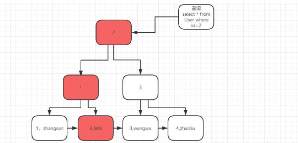
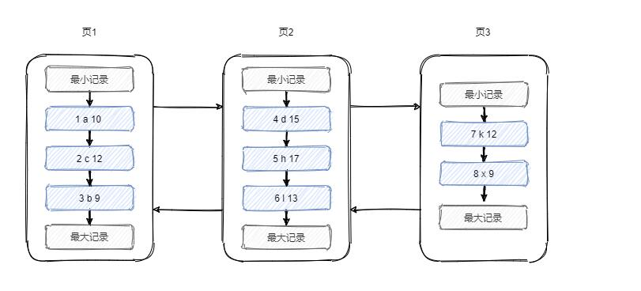
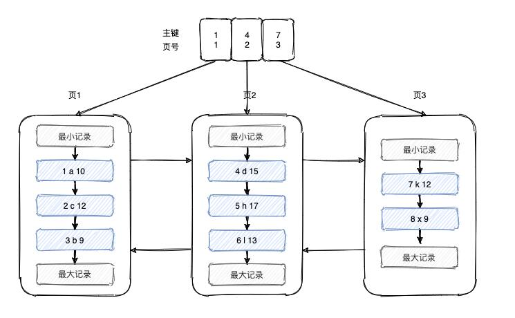
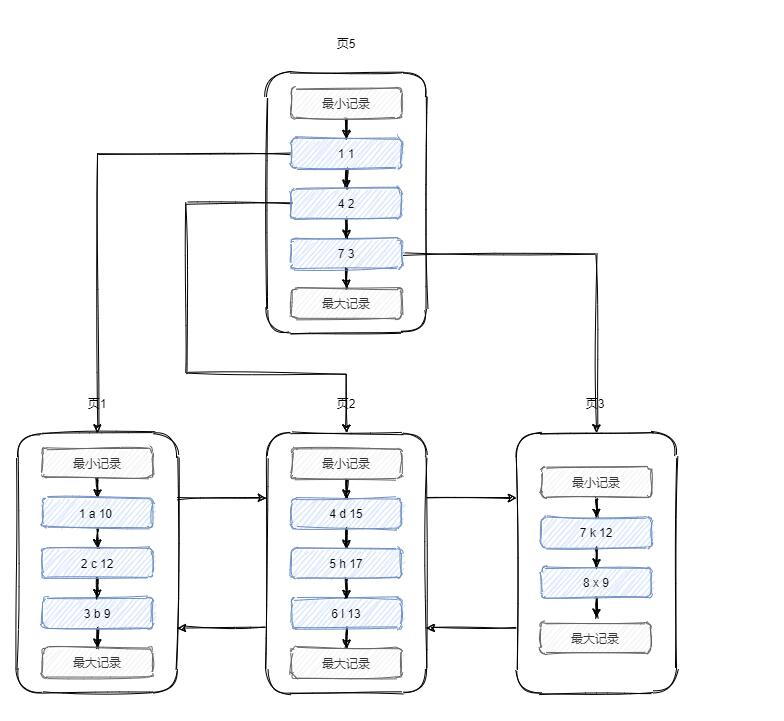
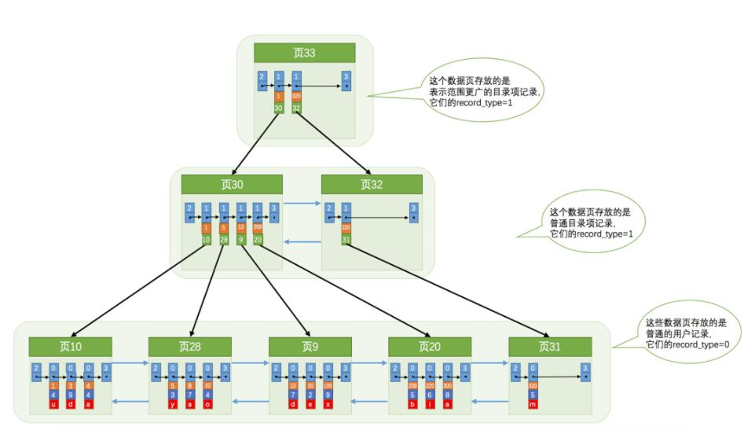
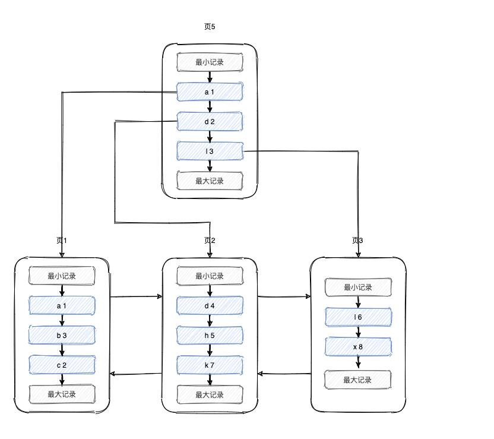
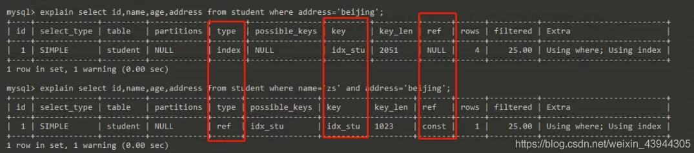

#索引

官方定义：索引（Index）是帮助MySQL高效获取数据的数据结构，即索引是数据结构。 其出现就是为了提高数据查询效率，就像书的目录。

>索引分为聚集索引和非聚集索引，用非聚集索引查询一般需要再次回表查询，因为非聚集索引存储的是主键ID，聚集索引查询就好似书的目录，用索引可以快速定位某一块区域数据，如果不用索引就需要全表扫描；还有多个字段组成联合索引，一般要符合最左匹配原则；
>
>in or 关键字就不走索引，like模糊匹配，前通配不走索引，后通配走索引

mysql是按照页来存储数据的，每个页的大小为16k。

### 聚集索引

聚集索引，也被称为”主键索引“，是InnoDB 引擎中是最重要的索引结构，主键索引的数据结构是一颗“B+树”，树的子节点存储索引节点信息及关联关系，树的叶子节点存储主键索引信息+数据，一颗树的叶子节点按照主键索引有序排列开来，查找起来更便捷。

例如有一张表： User表 Id是主键

我们查询id=2 这笔数据的过程如下：

先找到对应根索引2<3,向树的左边继续查找，查找到最下面的叶子节点，查找到这个节点对应的数据进行返回。

**PS**：**MyISAM** 的行记录是单独存储的，不和索引在一起，因此 MyISAM也就没有聚集索引。

另外需要注意，在 InnoDB 中有且只有一个聚集索引。它有三种情况：
1. 若表存在主键，则主键索引就是聚集索引。
2. 若不存在主键，则会把第一个非空的唯一索引作为聚集索引。
3. 否则，就会隐式的定义一个 rowid 作为聚集索引。

#### 原理

> 在**InnoDB存储引擎中，是以主键为索引来组织数据的**。记录在页中按照主键从小到大的顺序以单链表的形式连接在一起.

如果在创建表时没有显示的定义主键，则InnoDB存储引擎会按如下方式选择或创建主键。
1. 首先判断表中是否有非空的唯一索引，如果有，则该列即为主键。如果有多个非空唯一索引时，InnoDB存储引擎将选择建表时第一个定义的非空唯一索引作为主键
2. 如果不符合上述条件，InnoDB存储引擎自动创建一个6字节大小的指针作为索引

**页和页之间以双链表的形式连接在一起**。并且下一个数据页中用户记录的主键值必须大于上一个数据页中用户记录的主键值

假设一个页只能存放3条数据，则数据存储结构如下

可以看到我们想查询一个数据或者插入一条数据的时候，需要从最开始的页开始，依次遍历每个页的链表，效率并不高.

我们可以给这页做一个目录，保存主键和页号的映射关系，根据二分法就能快速找到数据所在的页。但这样做的前提是这个映射关系需要保存到连续的空间，如数组。如果这样做会有如下几个问题

随着数据的增多，目录所需要的连续空间越来越大，并不现实
1. 当有一个页的数据全被删除了，则相应的目录项也要删除，它后面的目录项都要向前移动，成本太高
2. 我们可以把目录数据放在和用户数据类似的结构中，如下所示。目录项有2个列，主键和页号

数据很多时，一个目录项肯定很多，毕竟一个页的大小为16k，我们可以对数据建立多个目录项目，在目录项的基础上再建目录项，如下图所示

图片来自《MySQL 是怎样运行的：从根儿上理解 MySQL》
这其实就是一颗B+树，也是一个聚集索引，即数据和索引在一块。叶子节点保存所有的列值

>以**InnoDB**的一个整数字段索引为例，这个 N 差不多是 1200。这棵树高是 4 的时候，就可以存 1200 的 3 次方个值，这已经17 亿了。考虑到树根的数据块总是在内存中的，一个 10 亿行的表上一个整数字段的索引，查找一个值最多只需要访问 3次磁盘。其实，树的第二层也有很大概率在内存中，那么访问磁盘的平均次数就更少了。《MySQL实战45讲》

### 非聚集索引

非聚集索引，譬如：我们常用的普通索引、复合索引、唯一索引。

非聚集索引存储的是具体的索引字段信息，而叶子节点存储主键索引+数据，为了要找到“zhangsan”这行数据，需要先在非聚集索引中找到对应的主键，再根据主键索引，查找对应的行数据，等于走了两遍B+树进行搜索，效率上肯定比主键索引低

#### 原理

非聚集索引叶子节点的值为**索引列+主键**

当我们查询name为h的用户信息时（学号，姓名，年龄），因为name上建了索引，先从name非聚集索引上，找到对应的主键id，然后根据主键id从聚集索引上找到对应的记录。

从非聚集索引上找到对应的主键值然后到聚集索引上查找对应记录的过程为回表

### 回表查询

在主键索引树上，通过主键就可以一次性查出来我们所需要的数据，速度非常的快。

因为主键和行记录就存储在一起，定位到了主键，也就定位到了所要找的记录，当前行的所有字段都在这（这也是为什么我们说，在创建表的时候，最好是创建一个主键，查询时也尽量用主键来查询）。

对于普通索引，则需要根据where条件后条件字段对应的的索引树（非聚集索引）找到叶子节点对应的主键，然后再通过主键去主键索引树查询一遍，才可以得到要找的记录。这就叫**回表查询**。

### 索引覆盖

官方说就是在用这个索引查询时，使它的索引树，查询到的叶子节点上的数据可以覆盖到你查询的所有字段，这样就可以避免回表.

举例子：有一张表 user ,里面有个联合索引 KEY(name,age),用sql查的时候select中的字段都在这个索引的B+树的叶子节点上.不需要回表查询.就叫索引覆盖

### 最左前缀原则

最左前缀原则，顾名思义，就是最左边的优先。指的是联合索引中，优先走最左边列的索引。如上表中，name和age的联合索引，相当于创建了 name 单列索引和 (name,age)联合索引。在查询时，where 条件中若有 name 字段，则会走这个联合索引。

对于多个字段的联合索引，也同理。如 index(a,b,c) 联合索引，则相当于创建了 a 单列索引，(a,b)联合索引，(a,c)联合索引, 和(a,b,c)联合索引。

假如有这样一张student表,表中有联合索引,idx_stu(name,age,address)
观察最左前缀原则的使用

会发现，若不符合最左前缀原则，则 type为 index，若符合，则 type 为 ref。

index 代表的是会对整个索引树进行扫描，如例子中的，最右列 address，就会导致扫描整个索引树。

ref 代表 mysql 会根据特定的算法查找索引，这样的效率比 index 全扫描要高一些。但是，它对索引结构有一定的要求，索引字段必须是有序的。而联合索引就符合这样的要求！

联合索引内部就是有序的，我们可以把它理解为类似于 order by name,age,address 这样的排序规则。会先根据 name 排序，若name 相同，再根据 age 排序，依次类推。

## 面试

问：为什么使用索引后查询效率高呢？

答：这个就涉及到索引和数据的结构了，类比书籍的目录页，索引通过B+树的结构存放数据，横向数据越多，纵向的高低越低，和磁盘的交互就越少，查询得速度就越快
