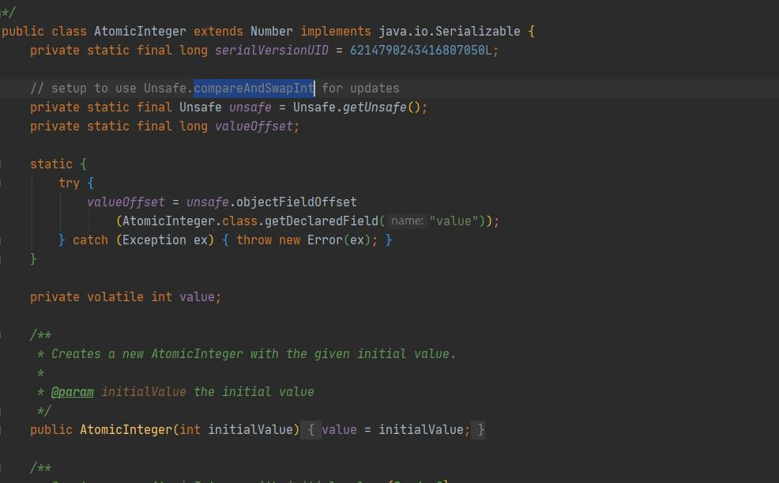
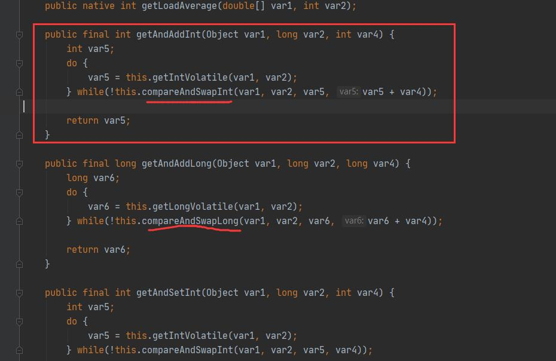
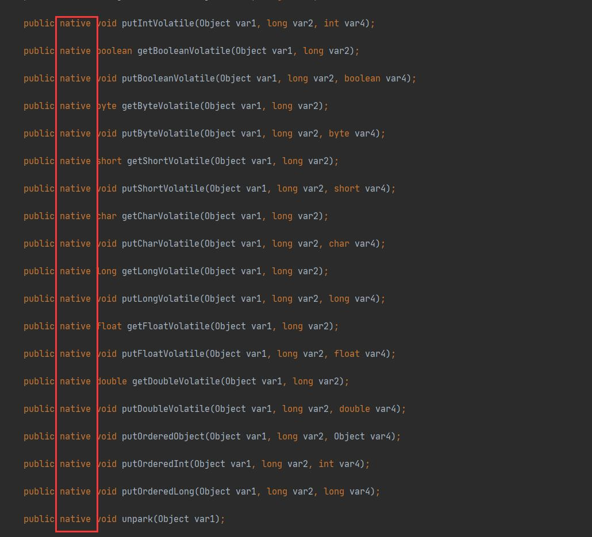

# AtomicInteger

变量value用volatile修饰，保证多线程之间的内存的可见性.

变量valueOffset，表示该变量值在内存中的偏移地址，因为Unsafe就是根据内存偏移地址获取数据的。

**unsafe方法：**

unsafe是CAS的核心类，由于Java方法无法直接访问底层系统，需要通过本地（native)方法来访问，Unsafe相当于一个后门，基于该类可以直接操作特定内存的数据。Unsafe类存在于sun.misc包中，其内部方法操作可以像C的指针一样直接操作内存，因为Java中CAS操作的执行依赖于Unsafe类的方法。

**注意Unsafe类中的所有方法都是native修饰的，也就是说Unsafe类中的方法都直接用操作系统底层资源执行相应任务**

第一步：将从本地内存中拷贝变量到自己的工作内存

第二步：调用CAS方法进行比较并交换（用该对象当前的值与var5比较:
如果相同，更新var5+var4并且返回true;
如果不同，继续取值然后再比较，直到更新完成。
）
