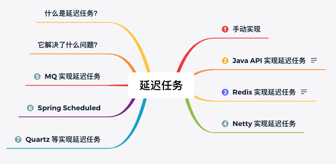
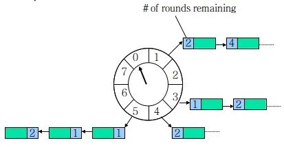
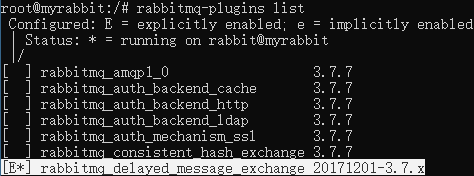

# 延迟任务



## 什么是延迟任务？

顾明思议，我们**把需要延迟执行的任务叫做延迟任务** 。

延迟任务的**使用场景** 有以下这些：

1. 红包 24 小时未被查收，需要延迟执退还业务；
2. 每个月账单日，需要给用户发送当月的对账单；
3. 订单下单之后 30 分钟后，用户如果没有付钱，系统需要自动取消订单。

等事件都需要使用延迟任务。

## 延迟任务实现思路分析

延迟任务**实现的关键是在某个时间节点执行某个任务** 。基于这个信息我们可以想到**实现延迟任务的手段** 有以下两个：

1. 自己手写一个“死循环”一直判断当前时间节点有没有要执行的任务；
2. 借助 JDK 或者第三方提供的工具类来实现延迟任务。

而通过 JDK 实现延迟任务我们能想到的关键词是：DelayQueue、ScheduledExecutorService，而第三方提供的延迟任务执行方法就有很多了，例如：Redis、Netty、MQ 等手段。

## 延迟任务实现

下面我们将结合代码来讲解每种延迟任务的具体实现。

### 1.无限循环实现延迟任务

此方式我们需要开启一个无限循环一直扫描任务，然后使用一个 Map 集合用来存储任务和延迟执行的时间，实现代码如下：

```java
import lombok.extern.slf4j.Slf4j;

import java.time.Instant;
import java.time.LocalDateTime;
import java.util.HashMap;
import java.util.Iterator;
import java.util.Map;

/**
 * 1. 无限循环实现延迟任务
 * <p>
 * Created by Js on 2022/8/5 .
 **/
@Slf4j
public class DelayTaskExampleLoop {
    // 存放定时任务
    private static Map<String, Long> _TaskMap = new HashMap<>();

    public static void main(String[] args) {
        log.info("程序启动时间：{}", LocalDateTime.now());
        // 添加定时任务
        _TaskMap.put("task-1", Instant.now().plusSeconds(3).toEpochMilli()); // 延迟 3s

        // 调用无限循环实现延迟任务
        loopTask();
    }

    /**
     * 无限循环实现延迟任务
     */
    public static void loopTask() {
        Long itemLong = 0L;
        while (true) {
            Iterator<Map.Entry<String, Long>> it = _TaskMap.entrySet().iterator();
            while (it.hasNext()) {
                Map.Entry entry = it.next();
                itemLong = (Long) entry.getValue();
                // 有任务需要执行
                if (Instant.now().toEpochMilli() >= itemLong) {
                    // 延迟任务，业务逻辑执行
                    log.info("执行任务：{} ，执行时间：{}",entry.getKey(), LocalDateTime.now());
                    // 删除任务
                    _TaskMap.remove(entry.getKey());
                }
            }
        }
    }
}
```

以上程序执行的结果为：

> 程序启动时间：2020-04-12T18:51:28.188
>
> 执行任务：task-1 ，执行时间：2020-04-12T18:51:31.189

可以看出任务延迟了 3s 钟执行了，符合我们的预期。

### 2.Java API 实现延迟任务

Java API 提供了**两种实现延迟任务的方法：`DelayQueue` 和 `ScheduledExecutorService`。**

#### ① ScheduledExecutorService 实现延迟任务

我们可以使用 `ScheduledExecutorService` 来以固定的频率一直执行任务，实现代码如下：

```java

import lombok.extern.slf4j.Slf4j;

import java.text.DateFormat;
import java.time.LocalDateTime;
import java.util.Date;
import java.util.concurrent.*;

/**
 * 2. Java API 提供了两种实现延迟任务的方法：DelayQueue 和 ScheduledExecutorService
 */
@Slf4j
public class DelayTaskExampleScheduledAndDelayQueue {
    public static void main(String[] args) {

        log.info("Scheduled--->程序启动时间：{}", LocalDateTime.now());
        scheduledExecutorServiceTask();
    }

    /**
     * ScheduledExecutorService 实现固定频率一直循环执行任务
     */
    public static void scheduledExecutorServiceTask() {
        ScheduledExecutorService executor = Executors.newScheduledThreadPool(1);
        executor.scheduleWithFixedDelay(
                () -> {
                    // 执行任务的业务代码
                    log.info("Scheduled--->执行任务，执行时间：{}", LocalDateTime.now());
                },
                2, // 初次执行间隔
                2, // 2s 执行一次
                TimeUnit.SECONDS);
    }
}
```

以上程序执行的结果为：

> Scheduled--->程序启动时间：2020-04-12T21:28:10.416
>
> Scheduled--->执行任务 ，执行时间：2020-04-12T21:28:12.421
>
> Scheduled--->执行任务 ，执行时间：2020-04-12T21:28:14.422
>
> ......

可以看出使用 `ScheduledExecutorService#scheduleWithFixedDelay(...)` 方法之后，会以某个频率一直循环执行延迟任务。

#### ② DelayQueue 实现延迟任务

`DelayQueue` 是一个支持延时获取元素的无界阻塞队列，队列中的元素必须实现 `Delayed` 接口，并重写 `getDelay(TimeUnit)` 和 `compareTo(Delayed)` 方法，通过poll()/take() 方法获取任务

- poll():获取并移除队列的超时元素，没有则返回空
- take():获取并移除队列的超时元素，如果没有则wait当前线程，直到有元素满足超时条件，返回结果。

**DelayQueue 实现延迟队列的完整代码** 如下：

```java

import lombok.extern.slf4j.Slf4j;

import java.text.DateFormat;
import java.time.LocalDateTime;
import java.util.Date;
import java.util.concurrent.*;

/**
 * 2. Java API 提供了两种实现延迟任务的方法：DelayQueue 和 ScheduledExecutorService
 */
@Slf4j
public class DelayTaskExampleScheduledAndDelayQueue {
    public static void main(String[] args) {

//        log.info("Scheduled--->程序启动时间：{}", LocalDateTime.now());
//        scheduledExecutorServiceTask();

        /**===========DelayQueue============**/

        DelayQueue delayQueue = new DelayQueue();
        // 添加延迟任务
        delayQueue.put(new DelayElement(1000));
        delayQueue.put(new DelayElement(3000));
        delayQueue.put(new DelayElement(5000));
        log.info("DelayQueue--->开始时间：{}" ,DateFormat.getDateTimeInstance().format(new Date()));
        while (!delayQueue.isEmpty()){
            // 执行延迟任务
            try {
                log.info("DelayQueue--->执行延迟任务: {}", delayQueue.take());
            } catch (InterruptedException e) {
                e.printStackTrace();
            }
        }
        log.info("DelayQueue--->结束时间：{}", DateFormat.getDateTimeInstance().format(new Date()));
    }

    /**
     * ScheduledExecutorService 实现固定频率一直循环执行任务
     */
    public static void scheduledExecutorServiceTask() {
        ScheduledExecutorService executor = Executors.newScheduledThreadPool(1);
        executor.scheduleWithFixedDelay(
                () -> {
                    // 执行任务的业务代码
                    log.info("Scheduled--->执行任务，执行时间：{}", LocalDateTime.now());
                },
                2, // 初次执行间隔
                2, // 2s 执行一次
                TimeUnit.SECONDS);
    }

    /**
     * DelayQueue 延迟队列
     *
     * DelayQueue 是一个支持延时获取元素的无界阻塞队列，队列中的元素必须实现 Delayed 接口，并重写 getDelay(TimeUnit) 和 compareTo(Delayed) 方法
     * 
     * poll():获取并移除队列的超时元素，没有则返回空
     * take():获取并移除队列的超时元素，如果没有则wait当前线程，直到有元素满足超时条件，返回结果。
     */
    static class DelayElement implements Delayed {
        // 延迟截止时间（单面：毫秒）
        long delayTime = System.currentTimeMillis();
        public DelayElement(long delayTime) {
            this.delayTime = (this.delayTime + delayTime);
        }
        // 获取剩余时间
        @Override
        public long getDelay(TimeUnit unit) {
            return unit.convert(delayTime - System.currentTimeMillis(), TimeUnit.MILLISECONDS);
        }
        // 队列里元素的排序依据
        @Override
        public int compareTo(Delayed o) {
            if (this.getDelay(TimeUnit.MILLISECONDS) > o.getDelay(TimeUnit.MILLISECONDS)) {
                return 1;
            } else if (this.getDelay(TimeUnit.MILLISECONDS) < o.getDelay(TimeUnit.MILLISECONDS)) {
                return -1;
            } else {
                return 0;
            }
        }
        @Override
        public String toString() {
            return DateFormat.getDateTimeInstance().format(new Date(delayTime));
        }
    }
}
```

以上程序执行的结果为：

> 开始时间：2020-4-12 20:40:38
>
> 2020-4-12 20:40:39
>
> 2020-4-12 20:40:41
>
> 2020-4-12 20:40:43
>
> 结束时间：2020-4-12 20:40:43

**优缺点**

优点:

    效率高,任务触发时间延迟低。

缺点:
    
    (1)消息不能持久化，存在jvm中，服务器重启后，数据全部消失，怕宕机 
    (2)集群扩展相当麻烦 
    (3)因为内存条件限制的原因，比如下单未付款的订单数太多，那么很容易就出现OOM异常 
    (4)代码复杂度较高

### 3.Redis 实现延迟任务

使用 Redis **实现延迟任务的方法大体可分为两类：通过 zset 数据判断的方式，和通过键空间通知的方式** 。

#### ① 通过数据判断的方式

我们借助 zset 数据类型，zset是一个有序集合，每一个元素(member)都关联了一个score,通过score排序来取集合中的值。

zset常用命令

    添加元素:ZADD key score member [[score member] [score member] ...]
    按顺序查询元素:ZRANGE key start stop [WITHSCORES]
    查询元素score:ZSCORE key member
    移除元素:ZREM key member [member ...]

具体就是把延迟任务存储在此数据集合中，然后在开启一个无线循环查询当前时间的所有任务进行消费。 实现代码如下（需要借助 Jedis 框架）：

```java
import redis.clients.jedis.Jedis;
import redis.clients.jedis.JedisPool;

import java.time.Instant;
import java.util.Set;

public class DelayQueueExampleRedis {
    // zset key
    public static final String _KEY = "Delay:myDelayQueue";

    public static void main(String[] args) throws InterruptedException {
        Jedis jedis = getJedis();
        // 延迟 30s 执行（30s 后的时间）
        long delayTime = Instant.now().plusSeconds(30).getEpochSecond();
        jedis.zadd(_KEY, delayTime, "order_1");
        // 继续添加测试数据
        jedis.zadd(_KEY, Instant.now().plusSeconds(2).getEpochSecond(), "order_2");
        jedis.zadd(_KEY, Instant.now().plusSeconds(2).getEpochSecond(), "order_3");
        jedis.zadd(_KEY, Instant.now().plusSeconds(7).getEpochSecond(), "order_4");
        jedis.zadd(_KEY, Instant.now().plusSeconds(10).getEpochSecond(), "order_5");
        // 开启延迟队列
        doDelayQueue(jedis);
    }

    /**
     * 延迟队列消费
     *
     * @param jedis Redis 客户端
     */
    public static void doDelayQueue(Jedis jedis) throws InterruptedException {
        while (true) {
            // 当前时间
            Instant nowInstant = Instant.now();
            long lastSecond = nowInstant.plusSeconds(-1).getEpochSecond(); // 上一秒时间
            long nowSecond = nowInstant.getEpochSecond();
            // 查询当前时间的所有任务
            Set<String> data = jedis.zrangeByScore(_KEY, lastSecond, nowSecond);
            for (String item : data) {
                // 消费任务
                System.out.println("消费：" + item);
            }
            // 删除已经执行的任务
            jedis.zremrangeByScore(_KEY, lastSecond, nowSecond);
            Thread.sleep(1000); // 每秒轮询一次
        }
    }

    public static Jedis getJedis(){
        return new JedisPool().getResource();
    }
}
```

#### ② 通过键空间通知

默认情况下 Redis 服务器端是不开启键空间通知的，需要我们通过 `config set notify-keyspace-events Ex` 的命令手动开启，开启键空间通知后，我们就可以拿到每个键值过期的事件，我们利用这个机制实现了给每个人开启一个定时任务的功能，实现代码如下：

```java
import redis.clients.jedis.Jedis;
import redis.clients.jedis.JedisPubSub;
import utils.JedisUtils;

public class TaskExample {
    public static final String _TOPIC = "__keyevent@0__:expired"; // 订阅频道名称
    public static void main(String[] args) {
        Jedis jedis = JedisUtils.getJedis();
        // 执行定时任务
        doTask(jedis);
    }

    /**
     * 订阅过期消息，执行定时任务
     * @param jedis Redis 客户端
     */
    public static void doTask(Jedis jedis) {
        // 订阅过期消息
        jedis.psubscribe(new JedisPubSub() {
            @Override
            public void onPMessage(String pattern, String channel, String message) {
                // 接收到消息，执行定时任务
                System.out.println("收到消息：" + message);
            }
        }, _TOPIC);
    }
}
```

### 4.Netty 实现延迟任务

Netty 是由 JBOSS 提供的一个 Java 开源框架，它是一个基于 NIO 的客户、服务器端的编程框架，使用 Netty 可以确保你快速和简单的开发出一个网络应用，例如实现了某种协议的客户、服务端应用。Netty 相当于简化和流线化了网络应用的编程开发过程，例如：基于 TCP 和 UDP 的 socket 服务开发。

可以使用 Netty 提供的工具类 HashedWheelTimer 来实现延迟任务，实现代码如下。

首先在项目中添加 Netty 引用，配置如下：

```
<!-- https://mvnrepository.com/artifact/io.netty/netty-common -->
<dependency>
    <groupId>io.netty</groupId>
    <artifactId>netty-common</artifactId>
    <version>4.1.48.Final</version>
</dependency>
```

Netty 实现的完整代码如下：

```
public class DelayTaskExample {
    public static void main(String[] args) {
        System.out.println("程序启动时间：" + LocalDateTime.now());
        NettyTask();
    }

    /**
     * 基于 Netty 的延迟任务
     */
    private static void NettyTask() {
        // 创建延迟任务实例
        HashedWheelTimer timer = new HashedWheelTimer(3, // 时间间隔
                TimeUnit.SECONDS,
                100); // 时间轮中的槽数
        // 创建一个任务
        TimerTask task = new TimerTask() {
            @Override
            public void run(Timeout timeout) throws Exception {
                System.out.println("执行任务" +
                        " ，执行时间：" + LocalDateTime.now());
            }
        };
        // 将任务添加到延迟队列中
        timer.newTimeout(task, 0, TimeUnit.SECONDS);

    }
}
```

以上程序执行的结果为：

> 程序启动时间：2020-04-13T10:16:23.033
>
> 执行任务 ，执行时间：2020-04-13T10:16:26.118

**HashedWheelTimer 是使用定时轮实现的，定时轮其实就是一种环型的数据结构** ，可以把它想象成一个时钟，分成了许多格子，每个格子代表一定的时间，在这个格子上用一个链表来保存要执行的超时任务，同时有一个指针一格一格的走，走到那个格子时就执行格子对应的延迟任务，如下图所示：


(图片来源于网络)

以上的图片可以理解为，时间轮大小为 8，某个时间转一格（例如 1s），每格指向一个链表，保存着待执行的任务。

时间轮算法可以类比于时钟，如上图箭头（指针）按某一个方向按固定频率轮动，每一次跳动称为一个 tick。这样可以看出定时轮由个3个重要的属性参数，ticksPerWheel（一轮的tick数），tickDuration（一个tick的持续时间）以及 timeUnit（时间单位），例如当ticksPerWheel=60，tickDuration=1，timeUnit=秒，这就和现实中的始终的秒针走动完全类似了。

如果当前指针指在1上面，我有一个任务需要4秒以后执行，那么这个执行的线程回调或者消息将会被放在5上。那如果需要在20秒之后执行怎么办，由于这个环形结构槽数只到8，如果要20秒，指针需要多转2圈。位置是在2圈之后的5上面（20 % 8 + 1）。

**优缺点**

优点:

    效率高,任务触发时间延迟时间比delayQueue低，代码复杂度比delayQueue低。

缺点:

    (1)服务器重启后，数据全部消失，怕宕机
    (2)集群扩展相当麻烦
    (3)因为内存条件限制的原因，比如下单未付款的订单数太多，那么很容易就出现OOM异常


### 5.MQ 实现延迟任务

如果专门开启一个 MQ 中间件来执行延迟任务，就有点杀鸡用宰牛刀般的奢侈了，不过已经有了 MQ 环境的话，用它来实现延迟任务的话，还是可取的。

几乎所有的 MQ 中间件(RabbitMQ、Kafka、RocketMQ..)都可以实现延迟任务，在这里更准确的叫法应该叫延队列。

本文就使用 RabbitMQ 为例，来看它是如何实现延迟任务的。

RabbitMQ 实现延迟队列的方式有两种：

* 通过消息过期后进入死信交换器，再由交换器转发到延迟消费队列，实现延迟功能；
* 使用 rabbitmq-delayed-message-exchange 插件实现延迟功能。

> 注意：延迟插件 rabbitmq-delayed-message-exchange 是在 RabbitMQ 3.5.7 及以上的版本才支持的，依赖 Erlang/OPT 18.0 及以上运行环境。

由于使用死信交换器比较麻烦，所以推荐使用第二种实现方式 rabbitmq-delayed-message-exchange 插件的方式实现延迟队列的功能。

首先，我们需要下载并安装 rabbitmq-delayed-message-exchange 插件，下载地址：http://www.rabbitmq.com/community-plugins.html

选择相应的对应的版本进行下载，然后拷贝到 RabbitMQ 服务器目录，使用命令 `rabbitmq-plugins enable rabbitmq_delayed_message_exchange` 开启插件，在使用命令 `rabbitmq-plugins list` 查询安装的所有插件，安装成功如下图所示：



最后重启 RabbitMQ 服务，使插件生效。

首先，我们先要配置消息队列，实现代码如下：

```
import com.example.rabbitmq.mq.DirectConfig;
import org.springframework.amqp.core.*;
import org.springframework.context.annotation.Bean;
import org.springframework.context.annotation.Configuration;
import java.util.HashMap;
import java.util.Map;

@Configuration
public class DelayedConfig {
    final static String QUEUE_NAME = "delayed.goods.order";
    final static String EXCHANGE_NAME = "delayedec";
    @Bean
    public Queue queue() {
        return new Queue(DelayedConfig.QUEUE_NAME);
    }

    // 配置默认的交换机
    @Bean
    CustomExchange customExchange() {
        Map<String, Object> args = new HashMap<>();
        args.put("x-delayed-type", "direct");
        //参数二为类型：必须是x-delayed-message
        return new CustomExchange(DelayedConfig.EXCHANGE_NAME, "x-delayed-message", true, false, args);
    }
    // 绑定队列到交换器
    @Bean
    Binding binding(Queue queue, CustomExchange exchange) {
        return BindingBuilder.bind(queue).to(exchange).with(DelayedConfig.QUEUE_NAME).noargs();
    }
}
```

然后添加增加消息的代码，具体实现如下：

```
import org.springframework.amqp.AmqpException;
import org.springframework.amqp.core.AmqpTemplate;
import org.springframework.amqp.core.Message;
import org.springframework.amqp.core.MessagePostProcessor;
import org.springframework.beans.factory.annotation.Autowired;
import org.springframework.stereotype.Component;
import java.text.SimpleDateFormat;
import java.util.Date;

@Component
public class DelayedSender {
    @Autowired
    private AmqpTemplate rabbitTemplate;

    public void send(String msg) {
        SimpleDateFormat sf = new SimpleDateFormat("yyyy-MM-dd HH:mm:ss");
        System.out.println("发送时间：" + sf.format(new Date()));

        rabbitTemplate.convertAndSend(DelayedConfig.EXCHANGE_NAME, DelayedConfig.QUEUE_NAME, msg, new MessagePostProcessor() {
            @Override
            public Message postProcessMessage(Message message) throws AmqpException {
                message.getMessageProperties().setHeader("x-delay", 3000);
                return message;
            }
        });
    }
}
```

再添加消费消息的代码：

```
import org.springframework.amqp.rabbit.annotation.RabbitHandler;
import org.springframework.amqp.rabbit.annotation.RabbitListener;
import org.springframework.stereotype.Component;
import java.text.SimpleDateFormat;
import java.util.Date;

@Component
@RabbitListener(queues = "delayed.goods.order")
public class DelayedReceiver {
    @RabbitHandler
    public void process(String msg) {
        SimpleDateFormat sdf = new SimpleDateFormat("yyyy-MM-dd HH:mm:ss");
        System.out.println("接收时间:" + sdf.format(new Date()));
        System.out.println("消息内容：" + msg);
    }
}
```

最后，我们使用代码测试一下：

```
import com.example.rabbitmq.RabbitmqApplication;
import com.example.rabbitmq.mq.delayed.DelayedSender;
import org.junit.Test;
import org.junit.runner.RunWith;
import org.springframework.beans.factory.annotation.Autowired;
import org.springframework.boot.test.context.SpringBootTest;
import org.springframework.test.context.junit4.SpringRunner;

import java.text.SimpleDateFormat;
import java.util.Date;

@RunWith(SpringRunner.class)
@SpringBootTest
public class DelayedTest {

    @Autowired
    private DelayedSender sender;

    @Test
    public void Test() throws InterruptedException {
        SimpleDateFormat sf = new SimpleDateFormat("yyyy-MM-dd");
        sender.send("Hi Admin.");
        Thread.sleep(5 * 1000); //等待接收程序执行之后，再退出测试
    }
}
```

以上程序的执行结果如下：

> 发送时间：2020-04-13 20:47:51
>
> 接收时间:2020-04-13 20:47:54
>
> 消息内容：Hi Admin.

从结果可以看出，以上程序执行符合延迟任务的实现预期。

### 6.使用 Spring 定时任务

如果你使用的是 Spring 或 SpringBoot 的项目的话，可以使用借助 Scheduled 来实现，本文将使用 SpringBoot 项目来演示 Scheduled 的实现，实现我们需要声明开启 Scheduled，实现代码如下：

```
@SpringBootApplication
@EnableScheduling
public class Application {
    public static void main(String[] args) {
        SpringApplication.run(Application.class, args);
    }
}
```

然后添加延迟任务，实现代码如下：

```
@Component
public class ScheduleJobs {
    @Scheduled(fixedDelay = 2 * 1000)
    public void fixedDelayJob() throws InterruptedException {
        System.out.println("任务执行，时间：" + LocalDateTime.now());
    }
}
```

此时当我们启动项目之后就可以看到任务以延迟了 2s 的形式一直循环执行，结果如下：

> 任务执行，时间：2020-04-13T14:07:53.349
>
> 任务执行，时间：2020-04-13T14:07:55.350
>
> 任务执行，时间：2020-04-13T14:07:57.351
>
> ...

我们也可以使用 Corn 表达式来定义任务执行的频率，例如使用 `@Scheduled(cron = "0/4 * * * * ?")` 。

### 7.Quartz 实现延迟任务

Quartz 是一款功能强大的任务调度器，可以实现较为复杂的调度功能，它还支持分布式的任务调度。

我们使用 Quartz 来实现一个延迟任务，首先定义一个执行任务代码如下：

```
import org.quartz.JobExecutionContext;
import org.quartz.JobExecutionException;
import org.springframework.scheduling.quartz.QuartzJobBean;

import java.time.LocalDateTime;

public class SampleJob extends QuartzJobBean {
    @Override
    protected void executeInternal(JobExecutionContext jobExecutionContext)
            throws JobExecutionException {
        System.out.println("任务执行，时间：" + LocalDateTime.now());
    }
}
```

在定义一个 JobDetail 和 Trigger 实现代码如下：

```
import org.quartz.*;
import org.springframework.context.annotation.Bean;
import org.springframework.context.annotation.Configuration;

@Configuration
public class SampleScheduler {
    @Bean
    public JobDetail sampleJobDetail() {
        return JobBuilder.newJob(SampleJob.class).withIdentity("sampleJob")
                .storeDurably().build();
    }

    @Bean
    public Trigger sampleJobTrigger() {
        // 3s 后执行
        SimpleScheduleBuilder scheduleBuilder =
                SimpleScheduleBuilder.simpleSchedule().withIntervalInSeconds(3).withRepeatCount(1);
        return TriggerBuilder.newTrigger().forJob(sampleJobDetail()).withIdentity("sampleTrigger")
                .withSchedule(scheduleBuilder).build();
    }
}
```

最后在 SpringBoot 项目启动之后开启延迟任务，实现代码如下：

```
import org.springframework.beans.factory.annotation.Autowired;
import org.springframework.boot.CommandLineRunner;
import org.springframework.scheduling.quartz.SchedulerFactoryBean;

/**
 * SpringBoot 项目启动后执行
 */
public class MyStartupRunner implements CommandLineRunner {

    @Autowired
    private SchedulerFactoryBean schedulerFactoryBean;

    @Autowired
    private SampleScheduler sampleScheduler;

    @Override
    public void run(String... args) throws Exception {
        // 启动定时任务
        schedulerFactoryBean.getScheduler().scheduleJob(
                sampleScheduler.sampleJobTrigger());
    }
}
```

以上程序的执行结果如下：

> 2020-04-13 19:02:12.331  INFO 17768 --- [  restartedMain] com.example.demo.DemoApplication         : Started DemoApplication in 1.815 seconds (JVM running for 3.088)
>
> 任务执行，时间：2020-04-13T19:02:15.019

从结果可以看出在项目启动 3s 之后执行了延迟任务。

## 总结

本文讲了延迟任务的使用场景，以及延迟任务的 10 种实现方式：

1. 手动无线循环；
2. ScheduledExecutorService；
3. DelayQueue；
4. Redis zset 数据判断的方式；
5. Redis 键空间通知的方式；
6. Netty 提供的 HashedWheelTimer 工具类；
7. RabbitMQ 死信队列；
8. RabbitMQ 延迟消息插件 rabbitmq-delayed-message-exchange；
9. Spring Scheduled；
10. Quartz。


> 转载：https://mp.weixin.qq.com/s/HEkQCC9v2l0EwJiAgfe5bg
