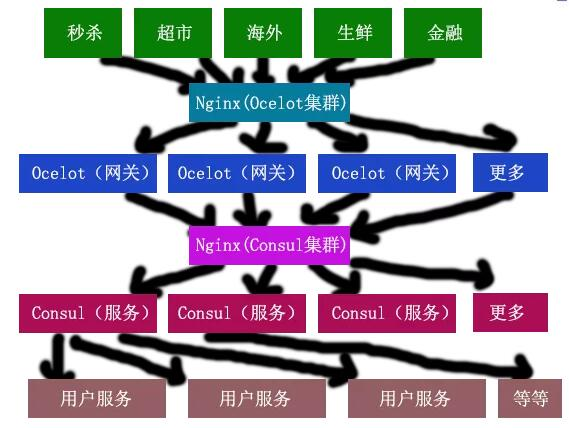

# 简介

>这些年软件的设计规模越来越庞大，业务需求也越来越复杂，针对系统的性能、高吞吐率、高稳定性、高扩展等特性提出了更高的要求。可以说业务需求是软件架构能力的第一推动力，由于这些因素导致了软件架构思想和相关技术也在发生着巨变。这些变化反应在软件架构行业里，就是我们开始越来越多的听到了很多新的词汇，比如：“分布式”、“SOA”、“微服务”、“中台”等概念。

# 架构发展历史

### 1、单体架构
> 单体应用时代：应用程序无论如何分层，都是一个解决方案，或者说都是一个项目，这里的“解决方案”和“项目”不是我们使用的 Visual Studio里面的概念，最终的程序代码都会在一个进程里运行。
 如图：  

**优点** ：

    开发简单，集中管理，没有分布式的损耗，都是系统进程内的通信。
    
**缺点** ：

    不好维护，升级困难，耦合严重，无法应付高并发和大数据场景，无法快捷迭代。
- （1）、只能采用同一种技术，很难用不同的语言或者相同语言不同版本开发不同模块。
- （2）、系统耦合性太强，其中一个模块有问题，这个系统就会瘫痪，一个模块升级，整个系统就得停机维护。
- （3）、要上线，必须一起上线，互相等待，无法快速相应市场需求。
- （4）、集群负担大，如果想要集群，只能对整个系统进行集群，即使一个模块有压力。
### 2、垂直拆分

> 随着业务规模的越来越庞大，系统设计就越来越复杂，大的系统就开始进行业务的垂直拆分。比如：有专门做商品秒杀的部门，有专门做生鲜商品的部门，有专门做超市的部门，等等，当然这是根据部门天生划分的，也有根据业务需求进行系统划分的。
 如图：

**优点**：

    垂直拆分，系统独立部署和维护，每个系统在自己进程内执行，分而治之。

**缺点**：

    拆分越多，存储越复杂，系统间重复的东西也越多，单个系统还是单体模式。

### 3、分布式服务

> 随着业务系统的越来越庞大，软件系统设计起来越来越复杂。为了避免过度复杂的业务需求，开始对业务系统的进行垂直拆分，形成多个独立的业务系统，如果多个系统之间要通信，可以通过跨进程的技术完成通讯。但是垂直拆分也导致了大量重复代码、重复模块的产生，比如：用户模块、日志模块、支付模块、认证授权模块等，这样分散的代码也给系统的维护和升级带来了困难。我们对业务重新划分，把独立的模块接口化、服务化，提高重用，这个时候，我们就开始进入了分布式服务的时代。（分布式的第一要务就是不要分布式）      
如图：   

**优点** ：

    1、独立进程部署，独立进程运行，独立演化。服务之间可以做到高内聚，低耦合。
    2、独立开发和维护，业务解耦，无论是业务系统还是分布式服务都独立演化。
    3、分布式管理
    4、隔离性增强
    5、由一系列服务组装成系统，不用重复建设，模块、代码可以复用。

**缺点** ：

    1、数据一致性（多服务完成一个任务）和系统的可用性（集群）成为问题
    2、数据库也进行了拆分。
    3、维护、设计、架构成本增加，调试、纠错更难。
    4、网络传输分布式损耗成本
    5、不适合高并发和大数据的环境。

### 4、微服务架构

> 微服务的出现时分布式架构已经很成熟了，架构中各种问题已经有了很成熟的解决方案，对于现在的业务系统来说，分布式架构已经变成了一种常规手段，这个时候，微服务就出现了。微服务架构是一个用分布式服务拆分业务逻辑，完成解耦的架构模式（架构风格）。
微服务肯定是分布式的一种，是在分布式技术成熟之后，然后把分布式当成解耦手段来架构系统-----因为拆分的服务很细致，服务数量规模开始变多了，服务的体量开始缩小了，由以前几个大的服务，转变为多个独立运行的、原子性质的服务。
如图：   

微服务最重要的特性是：

    （1）、可用性：描述一个系统在一段时间内提供有用资源的能力，从而减少停工时间，而保持其服务的高度可用性。
    （2）、伸缩性：根据需求动态添加和删除系统中资源的能力，是水平或垂直扩展的专门实现。

集群（负载均衡）可以解决系统的高可用和伸缩特性。

优点：

    （1）、可以使用不同语言或者相同语言的不同版本开发各个模块。
    （2）、系统耦合性低，各个模块分而治之，独立部署，独立发布，独立维护。
    （3）、可以更快的相应市场的需求，更符合敏捷开发。
    （4）、可以对不同模块使用集群策略，哪里有问题治哪里。

缺点：

    （1）、开发难度更大，系统结构更复杂。
    （2）、运行效率低，网络调用成本很大。

### 5、SOA面向服务架构

> Service-Oriented Architecture 面向服务架构：是一个组件模型，它将应用程序的不同功能单元（称为服务）进行拆分，并通过这些服务之间定义良好的接口和协议联系起来。        
如图：

# 微服务架构发展历程

> 我们要解决微服务的高可用和可伸缩的两个问题，自然就会想到通过集群来实现，这个思路没有错。如果我们实现了服务集群，那另外两个问题就会出现，这两个问题也导致了微服务架构的发展版本的差异。

- 第一个：服务的发现问题，调用方如何发现服务，有了新的服务，我们如何知道，有服务实例掉线，我们如何晓得，发现服务就很重要，这个是基础问题，第一个问题不解决，第二个问题也没有办法实现；
- 第二个：如何调用服务，如何管理那么多的服务实例。有那么多的集群实例，也就有那么多的服务实例，我们该怎么去调用这些服务呢？多个服务调用的关系如何呢？

由于这些问题，那我们就看看微服务架构的三个版本是如何解决的。

### 1、集中式代理----Nginx（V1.0 版本（服务注册/服务发现----手动））

    (1）、服务发现，手动修改配置文件，重新启动。
    (2）、负载均衡，可以轮训、权重、哈希等等。
    (3）、服务新增无法发现，需要手动配置，服务掉线可以自动检查。
    (4）、客户端的实现很简单，不需要额外的代码，简单，高效。
### 2、客户端嵌入----Consul（V2.0版本（服务注册/服务发现—自动---服务治理））

    (1）、服务注册与发现，动态增加，自动完成。
    (2）、健康检查，可以查看损坏服务，去掉服务，自动完成。
    (3）、负载均衡，Consul 返回所有活动服务实例，客户端自己实现负载均衡。

功能强大，自动发现-自动下线，客户端集成比较复杂，负载均衡在客户端实现。

### 3、服务网格-Service Mesh（V3.0---技术不成熟，华为+唯品会，lstio）

SideCar服务管理服务实例的注册和发现，服务实例的治理和调用。Service Mesh’s Control Plan 管理所有的 SideCar。这个技术我就不多谈了，网上的资料也很多，目前这个技术还不是很成熟，使用的范围也不是很广，只有一些大的公司有过使用，比如：微软等。

# 微服务架构必备技术栈

> 微服务是一种软件设计、架构思想，当然，里面也包含了相关技术点要解决当前要务。学习微服务，我们不能空口而谈，一定要落实到具体的技术栈上。当今使用比较多两个技术体系，一个是Java，另外一个就是Net，废话不多说，我是使用微软相关技术栈的软件架构人员，当然使用的“微服务”架构技术栈也都是微软的。今天我就把相关“微服务架构”所用到的技术栈罗列出来，我也要说明一下，微服务架构里面的很多技术是和开发语言无关的 ，无论是 .Net 还是 Java 平台都可以使用。以后，一步一步的针对每项技术在做深入研究。

### 1、服务通信

WebService、WCF、WebAPI，甚至可以是 ASHX,ASPX，这都是微软本身的技术体系，没什么可说的。

    (1）、主动触发
    (2）、数据序列化传递
    (3）、跨平台。
    (4）、跨语言
    (5）、Http 穿透防火墙。

### 2、进程通信

    (1）、Net Remoting：Net 平台督邮的，不支持跨平台。
    (2）、gRPC：高性能、开源和通用 RPC框架，面向服务端和移动端，基于 HTTP/2 设计，推荐使用。

### 3、API网关服务（Ocelot）

API网关—— 它是系统的暴露在外部的一个访问入口。这个有点像代理访问的家伙，就像一个公司的门卫承担着寻址、限制进入、安全检查、位置引导、等等功能。Ocelot是一个用.NET Core实现并且开源的API网关，它功能强大，包括了：路由、请求聚合、服务发现、认证、鉴权、限流熔断、并内置了负载均衡器与Service Fabric、Butterfly Tracing集成。这些功能只都只需要简单的配置即可完成。

官网：https://ocelot.readthedocs.io/en/latest/index.html

### 4、认证&授权

现在的应用开发层出不穷，基于浏览器的网页应用，基于微信的公众 号、小程序，基于IOS、Android的App，基于Windows系统的桌面应用和UWP应用等等，这么多种类的应用，就给应用的开发带来的挑战，我们除了分别实现各个应用外，我们还要考虑各个应用之间的交互，通用模块的提炼，其中身份的认证和授权就是每个应用必不可少的的一部分。而现在的互联网，对于信息安全要求又十分苛刻，所以一套统一的身份认证和授权就至关重要。

IdentityServer4就是这样一个框架，IdentityServer4是为ASP.NET CORE量身定制的实现了OpenId Connect和OAuth2.0协议的认证授权中间件。

项目地址：https://github.com/IdentityServer/IdentityServer4

### 5、瞬态故障处理

Polly它一款强大的类库，Polly是一种.NET弹性和瞬态故障处理库，允许我们以非常顺畅和线程安全的方式来执诸如行重试，断路，超时，故障恢复等策略。Polly针对 .NET 4.0，.NET 4.5和.NET Standard 1.1以及.NET Core实现，该项目作者现已成为.NET基金会一员，项目一直在不停迭代和更新，你值得拥有。       

项目地址：https://github.com/App-vNext/Polly

### 6、分布式追踪

随着微服务架构的流行，一些微服务架构下的问题也会越来越突出，比如一个请求会涉及多个服务，而服务本身可能也会依赖其他服务，整个请求路径就构成了一个网状的调用链，而在整个调用链中一旦某个节点发生异常，整个调用链的稳定性就会受到影响，所以会深深的感受到 “银弹” 这个词是不存在的，每种架构都有其优缺点 。

面对以上情况， 我们就需要一些可以帮助理解系统行为、用于分析性能问题的工具，以便发生故障的时候，能够快速定位和解决问题，这时候 APM（应用性能管理）工具就该闪亮登场了。  
项目地址：https://github.com/SkyAPM/SkyAPM-dotnet

### 7、分布式日志

一般我们需要进行日志分析场景：直接在日志文件中 grep、awk 就可以获得自己想要的信息。但在规模较大也就是日志量多而复杂的场景中，此方法效率低下，面临问题包括日志量太大如何归档、文本搜索太慢怎么办、如何多维度查询。需要集中化的日志管理，所有服务器上的日志收集汇总。常见解决思路是建立集中式日志收集系统，将所有节点上的日志统一收集，管理，访问。

大型系统通常都是一个分布式部署的架构，不同的服务模块部署在不同的服务器上，问题出现时，大部分情况需要根据问题暴露的关键信息，定位到具体的服务器和服务模块，构建一套集中式日志系统，可以提高定位问题的效率。

（1）、Exceptionless 是一个开源的实时的日志收集框架，它可以应用在基于 ASP.NET，ASP.NET Core，Web Api，Web Forms，WPF，Console，MVC 等技术栈的应用程序中，并且提供了Rest接口可以应用在 Javascript，Node.js 中。它将日志收集变得简单易用并且不需要了解太多的相关技术细节及配置。在以前，我们做日志收集大多使用 Log4net，Nlog 等框架，在应用程序变得复杂并且集群的时候，可能传统的方式已经不是很好的适用了，因为收集各个日志并且分析他们将变得麻烦而且浪费时间。

现在Exceptionless团队给我们提供了一个更好的框架来做这件事情，我认为这是非常伟大并且有意义的，感谢他们。

官网：http://exceptionless.com/

GitHub：https://github.com/exceptionless/Exceptionless

（2）、ELK是三个开源软件的缩写，分别为：Elasticsearch 、 Logstash以及Kibana , 它们都是开源软件。不过现在还新增了一个Beats，它是一个轻量级的日志收集处理工具(Agent)，Beats占用资源少，适合于在各个服务器上搜集日志后传输给Logstash，官方也推荐此工具，目前由于原本的ELK Stack成员中加入了 Beats 工具所以已改名为Elastic Stack。推荐使用。

### 8、分布式配置中心

Apollo（阿波罗）是携程框架部门研发的配置管理平台，能够集中化管理应用不同环境、不同集群的配置，配置修改后能够实时推送到应用端，并且具备规范的权限、流程治理等特性。

服务端基于 Spring Boot 和 Spring Cloud 开发，打包后可以直接运行，不需要额外安装 Tomcat 等应用容器。

Java 客户端不依赖任何框架，能够运行于所有 Java 运行时环境，同时对 Spring 环境也有较好的支持。

.Net 客户端不依赖任何框架，能够运行于所有 .Net 运行时环境。

项目地址：https://github.com/ctripcorp/apollo/

### 9、分布式锁

分布式锁的解决方案有很多，我在这里就罗列一些，我会在以后的实践中实现这些技术点。

    （1）、Consul 可以实现分布式锁
    （2）、Redis 可以实现分布式锁，推荐使用。
    （3）、Zookeeper 可以实现分布式锁
    （4）、数据库 可以实现分布式锁

### 10、分布式事务

分布式事务的实现方式也不少，以后努力学习吧。

    （1）、2PC（two-phase commit protocol，强一致性，没有可用性）
    （2）、3PC
    （3）、TCC（Try-Confirm-Cancel）
    （4）、本地消息表，推荐 RabbitMQ。
    （5）、Saga 模式

本地消息表：MQ分布式事务—本地消息表—基于消息的一致性。

    （1）、上有投递消息
    （2）、下游获取消息
    （3）、上游投递稳定性
    （4）、下游接受稳定性

### 11、容器化

Docker 是一个开源的应用容器引擎，可以打包应用以及依赖包到一个可移植的镜像中，然后发布到任何流行的 Linux 和Windows 机器上，也可以实现虚拟化。

Docker 使用客户端-服务器 (C/S) 架构模式，使用远程API来管理和创建Docker容器。Docker 容器通过 Docker 镜像来创建。容器与镜像的关系类似于面向对象编程中的对象与类。

Docker采用 C/S架构 Docker daemon 作为服务端接受来自客户的请求，并处理这些请求（创建、运行、分发容器）。客户端和服务端既可以运行在一个机器上，也可通过 socket 或者RESTful API 来进行通信。

Docker daemon 一般在宿主主机后台运行，等待接收来自客户端的消息。Docker 客户端则为用户提供一系列可执行命令，用户用这些命令实现跟 Docker daemon 交互。

如图：

### 12、容器编排

Kubernetes是Google开源的一个容器编排引擎，它支持自动化部署、大规模可伸缩、应用容器化管理。在生产环境中部署一个应用程序时，通常要部署该应用的多个实例以便对应用请求进行负载均衡。

在Kubernetes中，我们可以创建多个容器，每个容器里面运行一个应用实例，然后通过内置的负载均衡策略，实现对这一组应用实例的管理、发现、访问，而这些细节都不需要运维人员去进行复杂的手工配置和处理。

Kubernetes 也可以理解为Docker 的编排容器，是管理应用的全生命周期的工具，从创建应用/部署，应用提供服务，扩容缩容，更新，都非常的方便，而且可以做到故障自愈

中文社区：http://docs.kubernetes.org.cn/

官网：https://kubernetes.io/docs/home/

### 13、CI/CD

Jenkins 是一个开源的、提供友好操作界面的持续集成（CI）工具，主要用于持续、自动的构建/测试软件项目、监控外部任务的运行。

官网: http://www.jenkins.org.cn/
