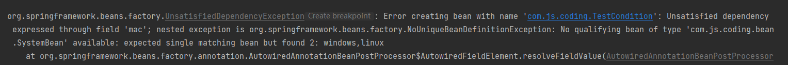
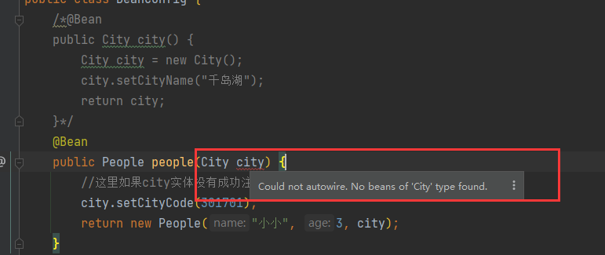

# @Conditional注解

>@Conditional是Spring4新提供的注解，它的作用是按照一定的条件进行判断，满足条件的才给容器注册Bean。

## 一、概述

1. @Conditional注解定义
```java
@Target({ElementType.TYPE, ElementType.METHOD})
@Retention(RetentionPolicy.RUNTIME)
@Documented
public @interface Conditional {
    Class<? extends Condition>[] value();
}
```
2. Condition
我们点进去看后，发现它是一个接口，有一个方法。
```java
@FunctionalInterface
public interface Condition {
    boolean matches(ConditionContext var1, AnnotatedTypeMetadata var2);
}
```
3. ConditionContext
它持有不少有用的对象，可以用来获取很多系统相关的信息，来丰富条件判断，接口定义如下:
```java
public interface ConditionContext {
    /**
    * 获取Bean定义
    */
    BeanDefinitionRegistry getRegistry();
    /**
    * 获取Bean工程，因此就可以获取容器中的所有bean
    */
    @Nullable
    ConfigurableListableBeanFactory getBeanFactory();
    /**
    * environment 持有所有的配置信息
    */
    Environment getEnvironment();
    /**
    * 资源信息
    */
    ResourceLoader getResourceLoader();
    /**
    * 类加载信息
    */
    @Nullable
    ClassLoader getClassLoader();
}
```

## 二、案例

> 假如现在需要根据当前系统环境的的不同 实例不同的Bean，比如现在是Linux那就实例一个Bean,如果是Window系统实例另一个Bean。

1. 首先创建一个Bean类：SystemBean
```java
@Data
@AllArgsConstructor
@NoArgsConstructor
public class SystemBean {
    /**
     * 系统名称
     */
    private String systemName;
    /**
     * 系统code
     */
    private String systemCode;
}

```
2. 通过Configuration配置实例化Bean
```java
@Configuration
public class ConditionalConfig {
    /**
     * 如果 WindowsCondition的实现方法返回true，则注入这个bean
     */
    @Bean("windows")
    @Conditional({WindowsCondition.class})
    public SystemBean systemWi() {
        log.info("ConditionalConfig方法注入 windows实体");
        return new SystemBean("windows系统","002");
    }
    /**
     * 如果LinuxCondition的实现方法返回true，则注入这个bean
     */
    @Bean("linux")
    @Conditional({LinuxCondition.class})
    public SystemBean systemLinux() {
        log.info("ConditionalConfig方法注入 linux实体");
        return new SystemBean("Linux系统","001");
    }
}
```
3. WindowsCondition和MacCondition
   这两个类都实现了Condition接口, 只有matches方法返回true才会实例化当前Bean
   1. WindowsCondition
```java
@Slf4j
public class WindowsCondition implements Condition {
    /**
     * @param conditionContext:判断条件能使用的上下文环境
     * @param annotatedTypeMetadata:注解所在位置的注释信息
     */
    @Override
    public boolean matches(ConditionContext conditionContext, AnnotatedTypeMetadata annotatedTypeMetadata) {
        //获取win使用的beanFactory
        ConfigurableListableBeanFactory beanFactory = conditionContext.getBeanFactory();
        //获取类加载器
        ClassLoader classLoader = conditionContext.getClassLoader();
        //获取当前环境信息
        Environment environment = conditionContext.getEnvironment();
        //获取bean定义的注册类
        BeanDefinitionRegistry registry = conditionContext.getRegistry();
        //获得当前系统名
        String property = environment.getProperty("os.name");
        //包含Windows则说明是windows系统，返回true
        if (property.contains("Windows")){
            log.info("当前操作系统是：Windows");
            return true;
        }
        return false;
    }
}

```
   2. LinuxCondition
```java
@Slf4j
public class LinuxCondition implements Condition {

   @Override
    public boolean matches(ConditionContext conditionContext, AnnotatedTypeMetadata annotatedTypeMetadata) {
        Environment environment = conditionContext.getEnvironment();
        String property = environment.getProperty("os.name");
        if (property.contains("Linux")) {
            log.info("当前操作系统是：Linux");
            return true;
        }
        return false;
    }
}

```
4. 测试
```java
/**
 * @author xub
 * @date 2019/6/13 下午10:42
 */
@SpringBootTest(classes = Application.class)
@RunWith(SpringRunner.class)
public class TestCondition {

    @Autowired
    private SystemBean windows;
    @Autowired
    private SystemBean linux;

    @Test
    public void test() {
        if (windows != null) {
            System.out.println("windows = " + windows);
        }
        if (linux != null) {
            System.out.println("Linux = " + linux);
        }
    }
}

```
运行结果：
```
2022-02-18 15:55:57.719  INFO 223016 --- [           main] com.js.coding.TestCondition              : No active profile set, falling back to default profiles: default
2022-02-18 15:55:58.186  INFO 223016 --- [           main] com.js.coding.bean.WindowsCondition      : 当前操作系统是：Windows
2022-02-18 15:55:58.564  INFO 223016 --- [           main] com.js.coding.config.ConditionalConfig   : ConditionalConfig方法注入 windows实体
2022-02-18 15:55:59.410  INFO 223016 --- [           main] com.js.coding.TestCondition              : Started TestCondition in 2.044 seconds (JVM running for 3.535)
windows = SystemBean(systemName=windows系统, systemCode=002)
Linux = SystemBean(systemName=windows系统, systemCode=002)

Process finished with exit code 0

```

通过运行结果可以看出
1. 虽然配置两个Bean,但这里只实例化了一个Bean,因为我这边是Windows电脑，所以实例化的是window的SystemBean
2. 注意一点，我们可以看出 Linux并不为null,而是linux实例化的Bean。说明 只要实例化一个Bean的，不管你命名什么，都可以注入这个Bean。

修改一下

这里做一个修改,我们把ConditionalConfig中的这行代码注释掉。
```java
// @Conditional({LinuxCondition.class})
```
再运行下代码:
```
2022-02-18 15:58:39.801  INFO 221940 --- [           main] com.js.coding.TestCondition              : No active profile set, falling back to default profiles: default
2022-02-18 15:58:40.273  INFO 221940 --- [           main] com.js.coding.bean.WindowsCondition      : 当前操作系统是：Windows
2022-02-18 15:58:40.650  INFO 221940 --- [           main] com.js.coding.config.ConditionalConfig   : ConditionalConfig方法注入 windows实体
2022-02-18 15:58:40.652  INFO 221940 --- [           main] com.js.coding.config.ConditionalConfig   : ConditionalConfig方法注入 linux实体
2022-02-18 15:58:41.482  INFO 221940 --- [           main] com.js.coding.TestCondition              : Started TestCondition in 2.026 seconds (JVM running for 3.309)
windows = SystemBean(systemName=windows系统, systemCode=002)
Linux = SystemBean(systemName=Linux系统, systemCode=001)
```
通过运行结果可以看出，配置类的两个Bean都已经注入成功了。
**注意**: 当同一个对象被注入两次及以上的时候，那么你在使用当前对象的时候，名称一定要是两个bean名称的一个,否则报错。比如修改为

```
    @Autowired
    private SystemBean windows;
    @Autowired
    private SystemBean linux;
    @Autowired
    private SystemBean mac;

```

在启动之后，报错了：



意思很明显，就是上面只实例化成功一个SystemBean的时候，你取任何名字，反正就是把当前已经实例化的对象注入给你就好了。

但是你现在同时注入了两个SystemBean,你这个时候有个名称为linux，它不知道应该注入那个Bean,所以采用了报错的策略。

**springboot对@Conditional的扩展**
- @Conditional是springboot实现自动配置的关键基础能力。在此基础上，springboot又创建了多个适用于不同场景的组合条件注解。
- @ConditionalOnBean：当上下文中有指定Bean的条件下进行实例化。
- @ConditionalOnMissingBean：当上下文没有指定Bean的条件下进行实例化。
- @ConditionalOnClass：当classpath类路径下有指定类的条件下进行实例化。
- @ConditionalOnMissingClass：当类路径下没有指定类的条件下进行实例化。
- @ConditionalOnWebApplication：当项目本身是一个Web项目时进行实例化。
- @ConditionalOnNotWebApplication：当项目本身不是一个Web项目时进行实例化。
- @ConditionalOnProperty：当指定的属性有指定的值时进行实例化。
- @ConditionalOnExpression：基于SpEL表达式的条件判断。
- @ConditionalOnJava：当JVM版本为指定的版本范围时进行实例化。
- @ConditionalOnResource：当类路径下有指定的资源时进行实例化。
- @ConditionalOnJndi：在JNDI存在时触发实例化。
- @ConditionalOnSingleCandidate：当指定的Bean在容器中只有一个，或者有多个但是指定了首选的Bean时触发实例化。

> 参考：https://blog.csdn.net/a8892117/article/details/101172493


# @ConditionalOnBean与@ConditionalOnClass

```

@ConditionalOnBean         //	当给定的在bean存在时,则实例化当前Bean
@ConditionalOnMissingBean  //	当给定的在bean不存在时,则实例化当前Bean
@ConditionalOnClass        //	当给定的类名在类路径上存在，则实例化当前Bean
@ConditionalOnMissingClass //	当给定的类名在类路径上不存在，则实例化当前Bean
@ConditionalOnExpression   //   当表达式为true的时候，才会实例化一个Bean

```

## 一、@ConditionalOnBean概念

>需求场景：在实例化People对象的时候，需要注入一个City对象。这个时候问题来了，如果city没有实例化，那么下面就会报空指针或者直接报错。
所以这里需求很简单，就是当前city存在则实例化people,如果不存在则不实例化people,这个时候@ConditionalOnBean 的作用来了。

```
    @Bean
    public People people(City city) {
        //这里如果city实体没有成功注入 这里就会报空指针
        city.setCityName("千岛湖");
        city.setCityCode(301701);
        return new People("小小", 3, city);
    }

```
1. @ConditionalOnBean注解定义

```java
@Target({ ElementType.TYPE, ElementType.METHOD })
@Retention(RetentionPolicy.RUNTIME)
@Documented
@Conditional(OnBeanCondition.class)
public @interface ConditionalOnBean {
    /**
     * 需要作为条件类的Class对象数组
     */
    Class<?>[] value() default {};
    /**
     * 需要作为条件类的Name,Class.getName()
     */
    String[] type() default {};
    /**
     *  (用指定注解修饰的bean)条件所需的注解类
     */
    Class<? extends Annotation>[] annotation() default {};
    /**
     * spring容器中bean的名字
     */
    String[] name() default {};
    /**
     * 搜索容器层级,当前容器,父容器
     */
    SearchStrategy search() default SearchStrategy.ALL;
    /**
     * 可能在其泛型参数中包含指定bean类型的其他类
     */
    Class<?>[] parameterizedContainer() default {};
}

```

## 二、@ConditionalOnBean示例

1. Bean实体

```java
@Data
@ToString
@AllArgsConstructor
@NoArgsConstructor
public class City {
    /**
     * 城市名称
     */
    private String cityName;
    /**
     * 城市code
     */
    private Integer cityCode;
}

```
```java
@Data
@ToString
@NoArgsConstructor
@AllArgsConstructor
public class People {
  /**
     * 姓名
     */
    private String name;
    /**
     * 年龄
     */
    private Integer age;
    /**
     *  城市信息
     */
    private City city;
}

```
2. Config类

City成功注入到IOC容器中

```java
@Configuration
public class BeanConfig {
    @Bean
    public City city() {
        City city = new City();
        city.setCityName("千岛湖");
        return city;
    }
    @Bean
    public People people(City city) {
        //这里如果city实体没有成功注入 这里就会报空指针
        city.setCityCode(301701);
        return new People("小小", 3, city);
    }
}

```

3. Test测试类

```java
@SpringBootTest(classes = Application.class)
@RunWith(SpringRunner.class)
public class TestConditionOn {

    @Autowired(required=false)
    private People people;
    
    @Test
    public void test() {
        System.out.println("= = = = = = = = = = = = = ");
        System.out.println("people = " + people);
        System.out.println("= = = = = = = = = = = = = ");
    }
}

```
运行结果：
```
= = = = = = = = = = = = = 
people = People(name=小小, age=3, city=City(cityName=千岛湖, cityCode=301701))
= = = = = = = = = = = = = 
```

一切正常，这个很符合我们实际开发中的需求。但是如果有一种情况，city并没有被注入。把上面这部分注释掉会怎么样呐。

```java
//    @Bean
//    public City city() {
//        City city = new City();
//        city.setCityName("千岛湖");
//        return city;
//    }

```
再次运行测试类：


发现启动直接报错了，这当然不是我们希望看到的，我们是要当city已经注入那么实例化people，如果没有注入那么不实例化people。

修改Config类，注释掉City,然后在People Bean上添加@ConditionalOnBean注解

```java
@Configuration
public class BeanConfig {
//    @Bean
//    public City city() {
//        City city = new City();
//        city.setCityName("千岛湖");
//        return city;
//    }

    /**
     * 这里加了ConditionalOnBean注解，就代表如果city存在才实例化people
     */
    @Bean
    @ConditionalOnBean(name = "city")
    public People people(City city) {
        //这里如果city实体没有成功注入 这里就会报空指针
        city.setCityCode(301701);
        return new People("小小", 3, city);
    }
}

```
运行：
```
= = = = = = = = = = = = = 
people = null
= = = = = = = = = = = = = 
```
很明显，上面因为city已经注释调，所以也导致无法实例化people，所以people为null。

注意有点要注意的，就是一旦使用@Autowired那就默认代表当前Bean一定是已经存在的，如果为null，会报错。所以这里要修改下。
```
@Autowired(required=false) //required=false 的意思就是允许当前的Bean对象为null。
```

> 参考：https://blog.csdn.net/yudiandemingzi/article/details/99993933
