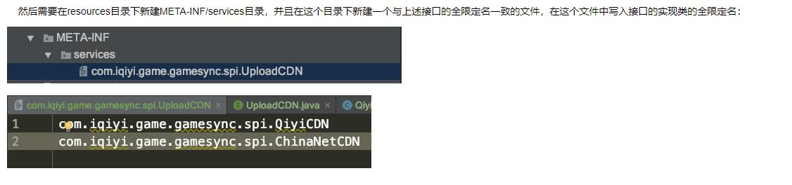
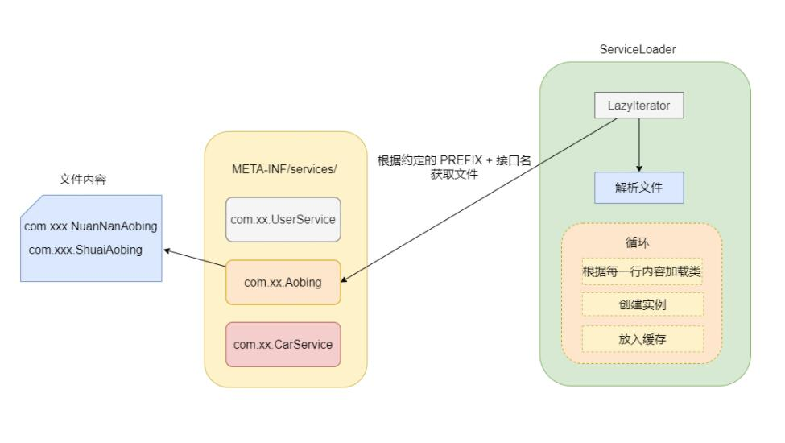

# SPI
> SPI全称Service Provider Interface，是Java提供的一套用来被第三方实现或者扩展的接口，它可以用来启用框架扩展和替换组件。 SPI的作用就是为这些被扩展的API寻找服务实现

> https://www.cnblogs.com/jy107600/p/11464985.html
>
> https://blog.csdn.net/qq_35190492/article/details/108256452

## Java SPI

### 1.什么是SPI

SPI全称Service Provider Interface，是Java提供的一套用来被第三方实现或者扩展的接口，它可以用来启用框架扩展和替换组件。 SPI的作用就是为这些被扩展的API寻找服务实现。

### 2.SPI和API的使用场景
    
> API （Application Programming Interface）在大多数情况下，都是实现方制定接口并完成对接口的实现，调用方仅仅依赖接口调用，且无权选择不同实现。 从使用人员上来说，API 直接被应用开发人员使用。

> SPI （Service Provider Interface）是调用方来制定接口规范，提供给外部来实现，调用方在调用时则选择自己需要的外部实现。  从使用人员上来说，SPI 被框架扩展人员使用。

### 3.Java SPI 示例

定义一组接口:

```java
public interface UploadCDN {
    void upload(String url);
}
```
这个接口分别有两个实现：

```java
public class QiyiCDN implements UploadCDN {  //上传爱奇艺cdn
    @Override
    public void upload(String url) {
        System.out.println("upload to qiyi cdn");
    }
}

public class ChinaNetCDN implements UploadCDN {//上传网宿cdn
    @Override
    public void upload(String url) {
        System.out.println("upload to chinaNet cdn");
    }
}

```



 这时，通过serviceLoader加载实现类并调用：

```
public static void main(String[] args) {
    ServiceLoader<UploadCDN> uploadCDN = ServiceLoader.load(UploadCDN.class);
    for (UploadCDN u : uploadCDN) {
        u.upload("filePath");
    }
}
```

这样一个简单的spi的demo就完成了。可以看到其中最为核心的就是通过ServiceLoader这个类来加载具体的实现类的

### Java SPI 源码分析



### Java SPI 缺点

Java SPI 在查找扩展实现类的时候遍历 SPI 的配置文件并且将实现类全部实例化，假设一个实现类初始化过程比较消耗资源且耗时，但是你的代码里面又用不上它，这就产生了资源的浪费。

所以说 Java SPI 无法按需加载实现类。

## Dubbo SPI

dubbo作为一个高度可扩展的rpc框架，也依赖于java的spi，并且dubbo对java原生的spi机制作出了一定的扩展，使得其功能更加强大。

首先，从上面的java spi的原理中可以了解到，java的spi机制有着如下的弊端：

- 只能遍历所有的实现，并全部实例化。
- 配置文件中只是简单的列出了所有的扩展实现，而没有给他们命名。导致在程序中很难去准确的引用它们。
- 扩展如果依赖其他的扩展，做不到自动注入和装配。
- 扩展很难和其他的框架集成，比如扩展里面依赖了一个Spring bean，原生的Java SPI不支持。

**dubbo的spi有如下几个概念**：

1. 扩展点：一个接口。
2. 扩展：扩展（接口）的实现。
3. 扩展自适应实例：其实就是一个Extension的代理，它实现了扩展点接口。在调用扩展点的接口方法时，会根据实际的参数来决定要使用哪个扩展。dubbo会根据接口中的参数，自动地决定选择哪个实现。
4. @SPI:该注解作用于扩展点的接口上，表明该接口是一个扩展点。
5. @Adaptive：@Adaptive注解用在扩展接口的方法上。表示该方法是一个自适应方法。Dubbo在为扩展点生成自适应实例时，如果方法有@Adaptive注解，会为该方法生成对应的代码。

Dubbo 对配置文件目录的约定，不同于 Java SPI ，Dubbo 分为了三类目录。

- META-INF/services/ 目录：该目录下的 SPI 配置文件是为了用来兼容 Java SPI 。
- META-INF/dubbo/ 目录：该目录存放用户自定义的 SPI 配置文件。
- META-INF/dubbo/internal/ 目录：该目录存放 Dubbo 内部使用的 SPI 配置文件。
