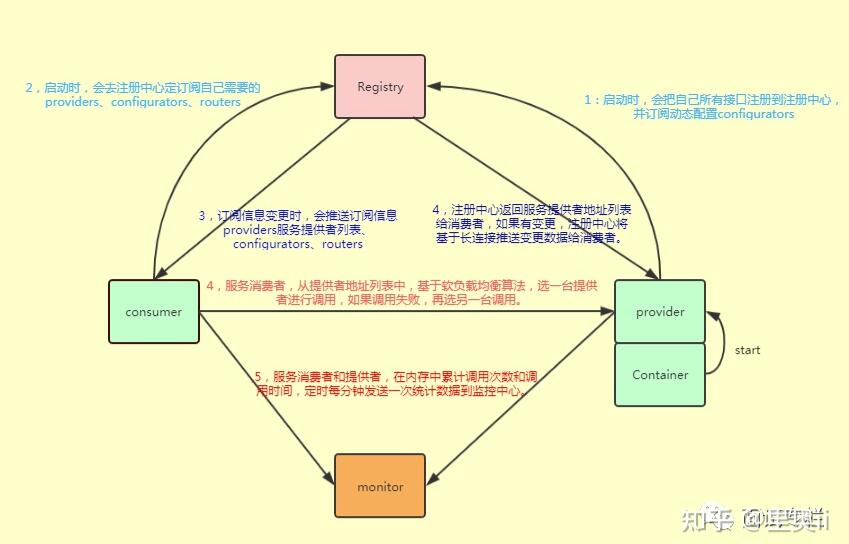

# Dubbo面试

> 转载：https://mp.weixin.qq.com/s/ZrexGFAxJpR6stMYMW0wag

37个Dubbo连环炮如下：

> 1、什么是Dubbo?\
2、为什么要用Dubbo？\
3、Dubbo能做什么？\
4、Dubbo 的整体架构设计有哪些分层？\
5、默认使用的是什么通信框架，还有别的选择吗？\
6、一般使用什么注册中心？还有别的选择吗？\
7、默认使用什么序列化框架，你知道的还有哪些？\
8、说说Hessian 序列化\
9、说说Dubbo 支持哪些协议，每种协议的应用场景和优缺点\
10、注册中心挂了，consumer 还能不能调用 provider？\
11、服务提供者能实现失效踢出是什么原理？\
12、服务上线怎么不影响旧版本？\
13、如何解决服务调用链过长的问题？\
14、说说核心的配置有哪些？\
15、Dubbo 推荐用什么协议？\
16、Dubbo 负载均衡策略？\
17、Dubbo 有哪些容错策略？\
18、Dubbo 动态代理策略有哪些？\
19、服务提供者没挂，但在注册中心里看不到，怎么办？\
20、Dubbo内置了哪几种服务容器？\
21、Dubbo启动时如果依赖的服务不可用会怎样？\
22、Dubbo如何优雅停机？\
23、说说 Dubbo 服务暴露的过程\
24、说说 Dubbo 服务引用的流程\
25、说说Dubbo的优先级配置\
26、说说一次 Dubbo 服务请求流程？\
27、同一个服务多个注册的情况下可以直连某一个服务吗？\
28、Dubbo 配置文件是如何加载到Spring中的？\
29、Dubbo 使用过程中都遇到了些什么问题，如何解决的？\
30、Dubbo 和 Dubbox 之间的区别？\
31、画一画服务注册与发现的流程图？\
32、Dubbo SPI 和 Java SPI 区别？\
33、Dubbo 支持分布式事务吗？\
34、Dubbo 可以对结果进行缓存吗？\
35、Dubbo 和 Spring Cloud 的区别？\
36、如何自己设计一个类似Dubbo的RPC 框架？\
37、Dubbo 用到哪些设计模式？\

接再来，我们正式开始Dubbo的36连环炮：

## 1、什么是Dubbo?

Dubbo是基于Java的高性能轻量级的RPC分布式服务框架，有阿里巴巴团队开发，现已成为 Apache 基金会孵化项目。

## 2、为什么要用Dubbo？

Dubbo 的诞生和 SOA 分布式架构的流行有着莫大的关系。SOA 面向服务的架构（Service Oriented Architecture），也就是把工程按照业务逻辑拆分成服务层、表现层两个工程。服务层中包含业务逻辑，只需要对外提供服务即可。表现层只需要处理和页面的交互，业务逻辑都是调用服务层的服务来实现。
SOA架构中有两个主要角色：

如果你要开发分布式程序，你也可以直接基于 HTTP 接口进行通信，但是为什么要用 Dubbo呢？
前面这段，可以作为面试的铺垫，但是重点在下面这段。
我觉得主要可以从 Dubbo 提供的下面四点特性来说为什么要用 Dubbo：

- 负载均衡——同一个服务部署在不同的机器时该调用那一台机器上的服务
- 服务调用链路生成——随着系统的发展，服务越来越多，服务间依赖关系变得错踪复杂，甚至分不清哪个应用要在哪个应用之前启动，架构师都不能完整的描述应用的架构关系。Dubbo 可以为我们解决服务之间互相是如何调用的。
- 服务访问压力以及时长统计、资源调度和治理——基于访问压力实时管理集群容量，提高集群利用率。
- 服务降级——某个服务挂掉之后调用备用服务 另外，Dubbo 除了能够应用在分布式系统中，也可以应用在现在比较火的微服务系统中。不过，由于 Spring Cloud 在微服务中应用更加广泛，所以，我觉得一般我们提 Dubbo 的话，大部分是分布式系统的情况。
- 服务提供者（Provider）
- 服务使用者（Consumer）

## 3、Dubbo能做什么？

透明化的远程方法调用，就像调用本地方法一样调用远程方法。

只需简单配置，没有任何API侵入。

软负载均衡及容错机制，可在内网替代F5等硬件负载均衡器，降低成本，减少单点。

服务自动注册与发现，不再需要写死服务提供方地址，注册中心基于接口名查询服务提供者的IP地址，并且能够平滑添加或删除服务提供者。

## 4、Dubbo 的整体架构设计有哪些分层？

Dubbo的整体设计分 10 层：

第一层：service 层，接口层，给服务提供者和消费者来实现的（留给开发人员来实现）；

第二层：config 层，配置层，主要是对 Dubbo 进行各种配置的，Dubbo 相关配置；

第三层：proxy 层，服务代理层，透明生成客户端的 stub 和服务单的 skeleton，调用的是接口，实现类没有，所以得生成代理，代理之间再进行网络通讯、负责均衡等；

第四层：registry 层，服务注册层，负责服务的注册与发现；

第五层：cluster 层，集群层，封装多个服务提供者的路由以及负载均衡，将多个实例组合成一 个服务；

第六层：monitor 层，监控层，对 rpc 接口的调用次数和调用时间进行监控；

第七层：protocol 层，远程调用层，封装 rpc 调用；

第八层：exchange 层，信息交换层，封装请求响应模式，同步转异步；

第九层：transport 层，网络传输层，抽象 mina 和 netty 为统一接口；

第十层：serialize 层，数据序列化层。

这是个很坑爹的面试题，但是很多面试官又喜欢问，你真的要背么？你能背那还是不错的，我建议 不要背，你就想想 Dubbo 服务调用过程中应该会涉及到哪些技术，把这些技术串起来就 OK 了。

## 5、默认使用的是什么通信框架，还有别的选择吗？

Dubbo 默认使用 Netty 框架，也是推荐的选择，另外内容还集成有Mina、Grizzly。

## 6、一般使用什么注册中心？还有别的选择吗？

Dubbo官方推荐使用 Zookeeper 作为注册中心，还有 Redis、Multicast、Simple 也可以作为Dubbo的注册中心。

## 7、默认使用什么序列化框架，你知道的还有哪些？

默认使用 Hessian 序列化，还有 Duddo、FastJson、Java 自带序列化。hessian是一个采用二进制格式传输的服务框架，相对传统soap web service，更轻量，更快速。

## 8、说说Hessian 序列化

- hessian中client与server的交互，基于http-post方式。
- hessian将辅助信息，封装在http header中，比如“授权token”等，我们可以基于http-header来封装关于“安全校验”“meta数据”等。hessian提供了简单的”校验”机制。
- 对于hessian的交互核心数据，比如“调用的方法”和参数列表信息，将通过post请求的body体直接发送，格式为字节流。
- 对于hessian的server端响应数据，将在response中通过字节流的方式直接输出。
- hessian的协议本身并不复杂，在此不再赘言；所谓协议(protocol)就是约束数据的格式，client按照协议将请求信息序列化成字节序列发送给server端，server端根据协议，将数据反序列化成“对象”，然后执行指定的方法，并将方法的返回值再次按照协议序列化成字节流，响应给client，client按照协议将字节流反序列化成”对象”。

## 9、说说Dubbo 支持哪些协议，每种协议的应用场景和优缺点

**dubbo**：单一长连接和 NIO 异步通讯，适合大并发小数据量的服务调用，以及消费者远大于提供者。传输协议 TCP，异步，Hessian 序列化；

**rmi**：采用 JDK 标准的 rmi 协议实现，传输参数和返回参数对象需要实现 Serializable 接口，使用 java 标准序列化机制，使用阻塞式短连接，传输数据包大小混合，消费者和提供者个数差不多，可传文件，传输协议 TCP。多个短连接，TCP 协议传输，同步传输，适用常规的远程服务调用和 rmi 互操作。在依赖低版本的 Common-Collections 包，java 序列化存在安全漏洞；

**webservice**：基于 WebService 的远程调用协议，集成 CXF 实现，提供和原生 WebService 的互操作。多个短连接，基于 HTTP 传输，同步传输，适用系统集成和跨语言调用；

**http**：基于 Http 表单提交的远程调用协议，使用 Spring 的 HttpInvoke 实现。多个短连接，传输协议 HTTP，传入参数大小混合，提供者个数多于消费者，需要给应用程序和浏览器 JS 调用；

**hessian**：集成 Hessian 服务，基于 HTTP 通讯，采用 Servlet 暴露服务，Dubbo 内嵌 Jetty 作为服务器时默认实现，提供与 Hession 服务互操作。多个短连接，同步 HTTP 传输，Hessian 序列化，传入参数较大，提供者大于消费者，提供者压力较大，可传文件；

**memcache**：基于 memcached 实现的 RPC 协议 redis：基于 redis 实现的 RPC 协议

## 10、注册中心挂了，consumer 还能不能调用 provider？

可以。因为刚开始初始化的时候，consumer 会将需要的所有提供者的地址等信息拉取到本地缓 存，所以注册中心挂了可以继续通信。但是 provider 挂了，那就没法调用了。

## 11、服务提供者能实现失效踢出是什么原理？

服务失效踢出基于Zookeeper的临时节点原理。

Zookeeper中节点是有生命周期的，具体的生命周期取决于节点的类型，节点主要分为持久节点(Persistent)和临时节点(Ephemeral) 。

## 12、服务上线怎么不影响旧版本？

通过Dubbo配置中的version版本来控制，设置多个版本即可。

比如：老版本version=1.0.0，那么新版本可以改成version=1.0.1。

## 13、如何解决服务调用链过长的问题？

Dubbo 可以使用 Pinpoint和 Apache Skywalking(Incubator)实现分布式服务追踪。也可以结合 zipkin 实现分布式服务追踪。

## 14、说说核心的配置有哪些？

- `dubbo:service/` 服务配置
- `ubbo:reference/` 引用配置
- `dubbo:protocol/` 协议配置
- `dubbo:registry/` 注册中心配置
- `dubbo:application/` 应用配置
- `dubbo:provider/` 服务提供者配置
- `dubbo:consumer/` 服务消费者配置
- `dubbo:method/` 方法配置
- `dubbo:argument` 参数配置

最后两个不回答，也是没问题的，但是得熟悉，面试官如果提示性的追问，这样就可以联系到方法和参数。

## 15、Dubbo 推荐用什么协议？

Dubbo支持dubbo、rmi、hessian、http、webservice、thrift、redis等多种协议，但是Dubbo官网是推荐我们使用dubbo协议的。

## 16、Dubbo 负载均衡策略？

随机（默认）：随机来
轮训：一个一个来
活跃度：机器活跃度来负载
一致性 hash：落到同一台机器上

## 17、Dubbo 有哪些容错策略？

### failover cluster 模式
provider 宕机重试以后，请求会分到其他的 provider 上，默认两次，可以手动设置重试次数，建议把写操作重试次数设置成 0。

### failback 模式
失败自动恢复会在调用失败后，返回一个空结果给服务消费者。并通过定时任务对失败的调用进行重试，适合执行消息通知等操作。

### failfast cluster 模式
快速失败只会进行一次调用，失败后立即抛出异常。适用于幂等操作、写操作，类似于 failover cluster 模式中重试次数设置为 0 的情况。

### failsafe cluster 模式
失败安全是指，当调用过程中出现异常时，仅会打印异常，而不会抛出异常。适用于写入审计日志等操作。

### forking cluster 模式
并行调用多个服务器，只要一个成功即返回。通常用于实时性要求较高的读操作，但需要浪费更多服务资源。可通过 forks="2" 来设置最大并行数。

### broadcacst cluster 模式
广播调用所有提供者，逐个调用，任意一台报错则报错。通常用于通知所有提供者更新缓存或日志等本地资源信息。

## 18、Dubbo 动态代理策略有哪些？
默认使用 javassist 动态字节码生成，创建代理类，但是可以通过 SPI 扩展机制配置自己的动态代理策略。

## 19、服务提供者没挂，但在注册中心里看不到，怎么办？
首先，确认服务提供者是否连接了正确的注册中心，不只是检查配置中的注册中心地址，而且要检查实际的网络连接。

其次，看服务提供者是否非常繁忙，比如压力测试，以至于没有CPU片段向注册中心发送心跳，这种情况减小压力将自动恢复。

## 20、Dubbo内置了哪几种服务容器？
Dubbo内置服务容器有三种：

- Spring Container
- Jetty Container
- Log4j Container

Dubbo 的服务容器只是一个简单的 Main 方法，并加载一个简单的 Spring 容器，用于暴露服务。

## 21、Dubbo启动时如果依赖的服务不可用会怎样？
Dubbo 缺省会在启动时检查依赖的服务是否可用，不可用时会抛出异常，阻止 Spring 初始化完成，默认 check="true"，可以通过 check="false" 关闭检查。

## 22、Dubbo如何优雅停机？
Dubbo 是通过 JDK 的 ShutdownHook 来完成优雅停机的，所以如果使用 kill -9 PID 等强制关闭指令，是不会执行优雅停机的，只有通过 kill PID 时，才会执行。

## 23、说说 Dubbo 服务暴露的过程
服务暴露会从Spring ioc容器刷新完成之后开始进行暴露。正式暴露前会将需要暴露的服务组装成URL对象，该对象存储了服务的ip、端口号、全路径名、parameters参数（路由、分组、版本、超时时间、应用名等配置信息）等配置信息。

通过proxyFactory.getInvoker方法，并利用javassist来进行动态代理，将服务暴露接口封装成invoker对象。然后开始正式暴露服务。

首先会将该invoker对象封装成export对象放入到exportedMap中供之后的远程调用查找。

然后会启动注册中心，将提供者信息注册到注册中心。

最后对configurations节点进行订阅。

以上就是服务暴露的总体流程。

## 24、说说 Dubbo 服务引用的流程
服务引用的时机有两种，一种是饿汉式即加载完毕就会引入，另一种是懒汉式即只有当这个服务被注入到其他类中时启动引入流程，默认是懒汉式。

服务引用首先会根据需要引入的配置信息组装成url对象，并根据提供者的协议进入Dubbo协议的引入即XXXProtocol.refer。然后获取注册中心，如果注册中心不存在会初始化注册中心。接下来会向注册中心注册消费者信息，并且订阅提供者、配置、路由等节点。

最后通过Cluster.join来包装invoker，默认是failoverCluster，最终通过proxyFactory.getProxy返回代理类，代理类中包含了NettyClient来进行远程通信。

## 25、说说Dubbo的优先级配置
配置优先级别 
1. 以timeout为例，显示了配置的查找顺序，其他retries，loadbalance等类似。

方法级优先，接口级次之，全局配置在次之
如果级别一样，则消费方优先，提供方次之
其中，服务提供方配置，通过URL经由注册中心传递给消费方
2. 建议由服务提供方设置超时，因为一个方法需要执行多长时间，服务提供方更清楚，如果一个消 费方同时引用多个服务，就不需要关心每个服务的超时设置。

## 26、说说一次 Dubbo 服务请求流程？
基本工作流程：



上图中角色说明：

|节点|角色说明|
|---|---|
|Provider|暴露服务的服务提供方|
|Customer|调用远程服务的服务消费者|
|Registry|服务注册与发现的注册中心|
|Monitor|统计服务的调用次数和调用时间的监控中心|
|Container|服务运行容器|

## 27、同一个服务多个注册的情况下可以直连某一个服务吗？
可以直连，修改配置即可，也可以通过 telnet 直接某个服务。

## 28、Dubbo 配置文件是如何加载到Spring中的？
Dubbo采用全Spring 配置方式，透明化接入应用，对应用没有任何API 侵入，只需用Spring加载Dubbo的配置即可。

Spring 容器在启动的时候，会读取到 Spring 默认的一些 schema 以及 Dubbo 自定义的 schema，每个 schema 都会对应一个自己的 NamespaceHandler，NamespaceHandler 里面通过 BeanDefinitionParser 来解析配置信息并转化为需要加载的 bean 对象
## 29、Dubbo 使用过程中都遇到了些什么问题，如何解决的？
下面罗列了七个问题，能说出三五个即可：

同时配置了 XML 和 properties 文件，则 properties中的配置无效
只有 XML 没有配置时，properties 才生效。

dubbo 缺省会在启动时检查依赖是否可用，不可用就抛出异常，阻止 Spring 初始化完成，check 属性默认为 true。
测试时有些服务不关心或者出现了循环依赖，将 check 设置为 false

为了方便开发测试，线下有一个所有服务可用的注册中心，这时，如果有一个正在开发中的服务提供者注册，可能会影响消费者不能正常运行。
解决：让服务提供者开发方，只订阅服务，而不注册正在开发的服务，通过直连测试正在开发的服务。设置 dubbo:registry标签的 register 属性为 false。

spring 2.x 初始化死锁问题。
在 spring 解析到 dubbo:service 时，就已经向外暴露了服务，而 spring 还在接着初始化其他 bean，如果这时有请求进来，并且服务的实现类里有调用 applicationContext.getBean() 的用法。getBean 线程和 spring 初始化线程的锁的顺序不一样，导致了线程死锁，不能提供服务，启动不了。

解决：不要在服务的实现类中使用 applicationContext.getBean()``; 如果不想依赖配置顺序，可以将dubbo:provider `的 deplay 属性设置为 - 1，使 dubbo 在容器初始化完成后再暴露服务。

服务注册不上
检查 dubbo 的 jar 包有没有在 classpath 中，以及有没有重复的 jar 包

检查暴露服务的 Spring 配置有没有加载

在服务提供者机器上测试与注册中心的网络是否通

出现 RpcException: No provider available for remote service 异常
表示没有可用的服务提供者，

a. 检查连接的注册中心是否正确

b. 到注册中心查看相应的服务提供者是否存在

c. 检查服务提供者是否正常运行

出现” 消息发送失败” 异常
通常是接口方法的传入传出参数未实现 Serializable 接口。

## 30、Dubbo 和 Dubbox 之间的区别？
Dubbox 是当当网基于 dubbo 上做了一些扩展，如加了服务可 restful 调用，更新了开源组件等。

## 31、画一画服务注册与发现的流程图？
这个可以参考官网给的图来画：


## 32、Dubbo SPI 和 Java SPI 区别？
### JDK SPI
JDK 标准的 SPI 会一次性加载所有的扩展实现，如果有的扩展吃实话很耗时，但也没用上，很浪费资源。所以只希望加载某个的实现，就不现实了。

### DUBBO SPI
1，对 Dubbo 进行扩展，不需要改动 Dubbo 的源码

2，延迟加载，可以一次只加载自己想要加载的扩展实现。

3，增加了对扩展点 IOC 和 AOP 的支持，一个扩展点可以直接 setter 注入其它扩展点。

4，Dubbo 的扩展机制能很好的支持第三方 IoC 容器，默认支持 Spring Bean。

## 33、Dubbo 支持分布式事务吗？
目前暂时不支持，可与通过 tcc-transaction 框架实现

介绍：tcc-transaction 是开源的 TCC 补偿性分布式事务框架

Git 地址：https://github.com/changmingxie/tcc-transaction

TCC-Transaction 通过 Dubbo 隐式传参的功能，避免自己对业务代码的入侵。

## 34、Dubbo 可以对结果进行缓存吗？
为了提高数据访问的速度

Dubbo 提供了声明式缓存，以减少用户加缓存的工作量

```
<dubbo:reference cache="true"
```

其实比普通的配置文件就多了一个标签 cache="true" 。

## 35、Dubbo 和 Spring Cloud 的区别？
根据微服务架构在各方面的要素，看看 Spring Cloud 和 Dubbo 都提供了哪些支持 。

### dubbo的优势
- 单一应用架构，当网站流量很小时，只需一个应用，将所有功能都部署在一起，以减少部署节点和成本。此时，用于简化增删改查工作量的 数据访问框架（ORM）是关键。
- 垂直应用架构，当访问量逐渐增大，单一应用增加机器带来的加速度越来越小，将应用拆成互不相干的几个应用，以提升效率。此时，用于加速前端页面开发的 Web框架（MVC）是关键。
- 分布式服务架构，当垂直应用越来越多，应用之间交互不可避免，将核心业务抽取出来，作为独立的服务，逐渐形成稳定的服务中心，使前端应用能更快速的响应多变的市场需求。此时，用于提高业务复用及整合的 分布式服务框架（RPC）是关键。
- 流动计算架构当服务越来越多，容量的评估，小服务资源的浪费等问题逐渐显现，此时需增加一个调度中心基于访问压力实时管理集群容量，提高集群利用率。此时，用于提高机器利用率的 资源调度和治理中心（SOA）是关键。

### SpringCloud优势

- 约定优于配置
- 开箱即用、快速启动
- 适用于各种环境
- 轻量级的组件
- 组件支持丰富，功能齐全

两者相比较：
1. Dubbo由于是二进制的传输，占用带宽会更少 
2. Spring Cloud是http协议传输，带宽会比较多，同时使用http协议一般会使用JSON报文，消耗 会更大 
3. Dubbo的开发难度较大，原因是dubbo的jar包依赖问题很多大型工程无法解决 
4. Spring Cloud的接口协议约定比较自由且松散，需要有强有力的行政措施来限制接口无序升级 
5. ~~dubbo的注册中心可以选择zk,redis等多种，springcloud的注册中心只能用eureka或者自研~~

## 35、如何自己设计一个类似Dubbo的RPC 框架？
遇到这类问题，起码从你了解的类似框架的原理入手，自己说说参照 dubbo 的原理，你来设计一下，举个例子，dubbo 不是有那么多分层么？而且每个分层是干啥的，你大概是不是知道？那就按照这个思路大致说一下吧，起码你不能懵逼，要比那些上来就懵，啥也说不出来的人要好一些。

举个栗子，我给大家说个最简单的回答思路：

- 上来你的服务就得去注册中心注册吧，你是不是得有个注册中心，保留各个服务的信息，可以用 zookeeper 来做，对吧。
- 然后你的消费者需要去注册中心拿对应的服务信息吧，对吧，而且每个服务可能会存在于多台机器上。
- 接着你就该发起一次请求了，咋发起？当然是基于动态代理了，你面向接口获取到一个动态代理，这个动态代理就是接口在本地的一个代理，然后这个代理会找到服务对应的机器地址。
- 然后找哪个机器发送请求？那肯定得有个负载均衡算法了，比如最简单的可以随机轮询是不是。
- 接着找到一台机器，就可以跟它发送请求了，第一个问题咋发送？你可以说用 netty 了，nio 方式；第二个问题发送啥格式数据？你可以说用 hessian 序列化协议了，或者是别的，对吧。然后请求过去了。
- 服务器那边一样的，需要针对你自己的服务生成一个动态代理，监听某个网络端口了，然后代理你本地的服务代码。接收到请求的时候，就调用对应的服务代码，对吧。

这就是一个最最基本的 rpc 框架的思路，先不说你有多牛逼的技术功底，哪怕这个最简单的思路你先给出来行不行？get到了吗？

## 37、Dubbo 用到哪些设计模式？

**装饰器模式**：为什么生产者和消费者都要转换为Invoker而不是不直接调用呢？我认为Invoker正是Dubbo设计精彩之处：真实调用都转换为Invoker，Dubbo就可以通过装饰器模式增强Invoker功能。

**责任链模式**：EchoFilter -> ClassLoaderFilter -> GenericFilter -> ContextFilter -> ，EchoFilter 的作用是判断是否是回声测试请求，是的话直接返回内容，这是一种责任链的体现。ClassLoaderFilter 则只是在主功能上添加了功能，更改当前线程的 ClassLoader，这是典型的装饰器模式。

**观察者模式**：Dubbo 的 Provider 启动时，需要与注册中心交互，先注册自己的服务，再订阅自己的服务，订阅时，采用了观察者模式，开启一个 listener。注册中心会每 5 秒定时检查是否有服务更新，如果有更新，向该服务的提供者发送一个 notify 消息，provider 接受到 notify 消息后，即运行 NotifyListener 的 notify 方法，执行监听器方法。

**动态代理模式**：Dubbo 扩展 JDK SPI 的类 ExtensionLoader 的 Adaptive 实现是典型的动态代理实现。Dubbo 需要灵活地控制实现类，即在调用阶段动态地根据参数决定调用哪个实现类，所以采用先生成代理类的方法，能够做到灵活的调用。生成代理类的代码是 ExtensionLoader 的createAdaptiveExtensionClassCode 方法。代理类的主要逻辑是，获取 URL 参数中指定参数的值作为获取实现类的 key。

**适配器模式**：为了让用户根据自己的需求选择日志组件，Dubbo自定义了自己的Logger接口，并为常见的日志组件（包括jcl, jdk, log4j, slf4j）提供相应的适配器。并且利用简单工厂模式提供一个LoggerFactory，客户可以创建抽象的Dubbo自定义Logger，而无需关心实际使用的日志组件类型。在LoggerFactory初始化时，客户通过设置系统变量的方式选择自己所用的日志组件，这样提供了很大的灵活性。

## 总结
其实，原本没打算搞Dubbo连环炮，但是有朋友私下催我赶紧发。为什么没打算写呢？因为Dubbo的文档是用中文写的，也是咱们国人写的，所以我觉得看文档就已经够了。

但是，话又说回来，很多朋友都只是用过Dubbo，或许还没有对其进行深入的了解学习，但为了应付面试，又觉得这个连环炮存在的意义在哪里了。
