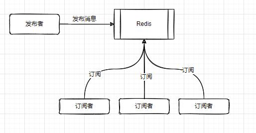

# Spring Boot Redis

转载：[芋道 Spring Boot Redis 入门](https://www.iocoder.cn/Spring-Boot/Redis/ "芋道 Spring Boot Redis 入门")

## 5.3 Session

首先，我们需要澄清下，Session 不是 Redis 的功能，而是 Spring Data Redis 封装的一个功能。一次 Session ，代表通过同一个 Redis Connection 执行一系列的 Redis 操作。

在 [「5.2.1 源码解析」](https://www.iocoder.cn/Spring-Boot/Redis/?yudao#) 中，我们可以发现，如果我们在一个 Redis Transaction 中的时候，所有 Redis 操作都使用通过同一个 Redis Connection ，因为我们会将获得到的 Connection 绑定到当前线程中。

但是，如果我们不在一个 Redis Transaction 中的时候，我们每一次使用 Redis Operations 执行 Redis 操作的时候，每一次都会获取一次 Redis Connection 的获取。实际项目中，我们必然会使用 Redis Connection 连接池，那么在获取的时候，会存在一定的竞争，会有资源上的消耗。那么，如果我们希望如果已知我们要执行一个系列的 Redis 操作，能不能使用同一个 Redis Connection ，避免重复获取它呢？答案是有，那就是 Session 。

当我们要执行在同一个 Session 里的操作时，我们通过实现 [`org.springframework.data.redis.core.SessionCallback<T>`](https://github.com/spring-projects/spring-data-redis/blob/master/src/main/java/org/springframework/data/redis/core/SessionCallback.java) 接口，其代码如下：

```
// SessionCallback.java

public interface SessionCallback<T> {

	@Nullable
	<K, V> T execute(RedisOperations<K, V> operations) throws DataAccessException;
}
```

* 相比 RedisCallback 来说，总比是比较相似的。但是比较友好的是，它的入参 `operations` 是 [org.springframework.data.redis.core.RedisOperations](https://github.com/spring-projects/spring-data-redis/blob/master/src/main/java/org/springframework/data/redis/core/RedisOperations.java) 接口类型，而 RedisTemplate 的各种操作，实际就是在 RedisOperations 接口中定义，由 RedisTemplate 来实现。所以使用上也会更加便利。

* 实际上，我们在实现 RedisCallback 接口，也能实现在同一个 Connection 执行一系列的 Redis 操作，因为 RedisCallback 的入参本身就是一个 Redis Connection 。

### 5.3.1 源码解析

在生产中，Transaction 和 Pipeline 会经常一起时候用，从而提升性能。所以在 `RedisTemplate#executePipelined(SessionCallback<?> session, ...)` 方法中，提供了这种的功能。而在这个方法的实现上，本质和 `RedisTemplate#executePipelined(RedisCallback<?> action, ...)` 方法是基本一致的，差别在于[这一行](https://github.com/spring-projects/spring-data-redis/blob/master/src/main/java/org/springframework/data/redis/core/RedisTemplate.java#L289) ，替换成了调用 `#executeSession(SessionCallback<?> session)` 方法。所以，我们来直接来看被调用的这个方法的实现。代码如下：


```
// RedisTemplate.java

@Override
public <T> T execute(SessionCallback<T> session) {

	Assert.isTrue(initialized, "template not initialized; call afterPropertiesSet() before using it");
	Assert.notNull(session, "Callback object must not be null");

	RedisConnectionFactory factory = getRequiredConnectionFactory();
	// bind connection
	// <1> 获得并绑定 Connection 。
	RedisConnectionUtils.bindConnection(factory, enableTransactionSupport);
	try {
	   // <2> 执行定义的一系列 Redis 操作
		return session.execute(this);
	} finally {
		// <3> 释放并解绑 Connection 。
		RedisConnectionUtils.unbindConnection(factory);
	}
}
```


* `<1>` 处，调用 `RedisConnectionUtils#bindConnection(RedisConnectionFactory factory, boolean enableTranactionSupport)` 方法，实际和我们开启 `enableTranactionSupport` 事务时候，获取 Connection 和处理的方式，是**一模一样** 的。也就是说：
    * 如果当前线程已经有一个绑定的 Connection 则直接使用（例如说，当前正在 Redis Transaction 事务中）；
    * 如果当前线程未绑定一个 Connection ，则进行创建并绑定到当前线程。甚至，如果此时是配置开启 `enableTranactionSupport` 事务的，那么此处就会触发 Redis Transaction 的开启。
* `<2>` 处，调用 `SessionCallback#execute(RedisOperations<K, V> operations)` 方法，执行我们定义的一系列的 Redis 操作。看看此处传入的参数是 `this` ，是不是仿佛更加明白点什么了？
* `<3>` 处，调用 [`RedisConnectionUtils#unbindConnection(RedisConnectionFactory factory)`](https://github.com/spring-projects/spring-data-redis/blob/64b89137648f6c0e0c810c624e481bcfc0732f4e/src/main/java/org/springframework/data/redis/core/RedisConnectionUtils.java#L253) 方法，释放并解绑 Connection 。当前，前提是当前不存在激活的 Redis Transaction ，不然不就提早释放了嘛。

恩，现在胖友在回过头，好好在想一想 Pipeline、Transaction、Session 之间的关系，以及组合排列。之后，我们在使用上，会更加得心应手。

### 5.3.2 具体示例

> 示例代码对应测试类：[SessionTest](https://github.com/YunaiV/SpringBoot-Labs/blob/master/lab-11-spring-data-redis/lab-07-spring-data-redis-with-jedis/src/test/java/cn/iocoder/springboot/labs/lab10/springdatarediswithjedis/SessionTest.java) 。

创建 [SessionTest](https://github.com/YunaiV/SpringBoot-Labs/blob/master/lab-11-spring-data-redis/lab-07-spring-data-redis-with-jedis/src/test/java/cn/iocoder/springboot/labs/lab10/springdatarediswithjedis/SessionTest.java) 单元测试类，编写代码如下：

```
// SessionTest.java

@RunWith(SpringRunner.class)
@SpringBootTest
public class SessionTest {

    @Autowired
    private StringRedisTemplate stringRedisTemplate;

    @Test
    public void test01() {
        String result = stringRedisTemplate.execute(new SessionCallback<String>() {

            @Override
            public String execute(RedisOperations operations) throws DataAccessException {
                for (int i = 0; i < 100; i++) {
                    operations.opsForValue().set(String.format("yunai:%d", i), "shuai02");
                }
                return (String) operations.opsForValue().get(String.format("yunai:%d", 0));
            }

        });

        System.out.println("result:" + result);
    }

}
```


执行 `#test01()` 方法，结果如下：

```
result:shuai02
```

* 卧槽，一直被 Redis 夸奖，已经超级不好意思了。

## 5.4 Pub/Sub

Redis 提供了 Pub/Sub 功能，实现简单的订阅功能，不了解的胖友，可以看看 [「Redis 文档 —— Pub/Sub」](http://redis.cn/topics/pubsub.html) 。

### 5.4.1 简介

> Redis提供了基于“发布/订阅”模式的消息机制。此种模式下，消息发布者和订阅者不进行直接通信，发布者客户端向指定的频道（channel） 发布消息，订阅该频道的每个客户端都可以收到该消息，如图1所示。
> Redis提供了若干命令支持该功能，在实际应用开发时，能够为此类问题提供实现方法。



#### 两种信息机制

1. 订阅指定频道-SUBSCRIBE【ChannelTopic】
   `SUBSCRIBE channel [channel2]...`
   `SUBSCRIBE 频道名 [频道名2]...`
```
127.0.0.1:6379> subscribe channel1
Reading messages... (press Ctrl-C to quit)
1) "subscribe"
2) "channel1"
3) (integer) 1

```
   >Redis采用SUBSCRIBE命令订阅某个频道，其返回值包括客户端订阅的频道，目前已订阅的频道数量，以及接收到的消息，其中subscribe表示已经成功订阅了某个频道。
2. 订阅匹配频道-PSUBSCRIBE【PatternTopic】
   匹配模式可以订阅名称匹配符合的频道
   `PSUBSCRIBE channel*`
   代表订阅`channel`开头的频道
```
127.0.0.1:6379> psubscribe channel*
Reading messages... (press Ctrl-C to quit)
1) "psubscribe"
2) "channel*"
3) (integer) 1
```
>模式匹配功能允许客户端订阅符合某个模式的频道，Redis采用PSUBSCRIBE订阅符合某个模式所有频道，用`*`表示模式，`*`可以被任意值代替。
   
>假设客户端同时订阅了某种模式和符合该模式的某个频道，那么发送给这个频道的消息将被客户端接收到两次，只不过这两条消息的类型不同，一个是message类型，一个是pmessage类型，但其内容相同

>匹配模式要注意,匹配的名称可以在以后出现,但凡是知道会有哪些频道出现,都尽量不要用这个模式,可能会在之后出现一个你没有预料到的频道的消息

### 5.4.2 源码解析

暂时不提供，感兴趣的胖友，可以自己看看最核心的 [`org.springframework.data.redis.listener.RedisMessageListenerContainer`](https://github.com/spring-projects/spring-data-redis/blob/master/src/main/java/org/springframework/data/redis/listener/RedisMessageListenerContainer.java) 类，Redis 消息监听器容器，基于 Pub/Sub 的 [SUBSCRIBE](http://redis.cn/commands/subscribe.html)、[PSUBSCRIBE](http://redis.cn/commands/psubscribe.html) 命令实现，我们只需要添加相应的 [`org.springframework.data.redis.connection.MessageListener`](https://github.com/spring-projects/spring-data-redis/blob/64b89137648f6c0e0c810c624e481bcfc0732f4e/src/main/java/org/springframework/data/redis/connection/MessageListener.java) 即可。不算复杂，1000 多行，只要调试下核心的功能即可。

### 5.4.3 具体示例

> 示例代码对应测试类：[PubSubTest](https://github.com/YunaiV/SpringBoot-Labs/blob/master/lab-11-spring-data-redis/lab-07-spring-data-redis-with-jedis/src/test/java/cn/iocoder/springboot/labs/lab10/springdatarediswithjedis/PubSubTest.java) 。

Spring Data Redis 实现 Pub/Sub 的示例，主要分成两部分：

* 配置 RedisMessageListenerContainer Bean 对象，并添加我们自己实现的 MessageListener 对象，用于监听处理相应的消息。
* 使用 RedisTemplate 发布消息。

下面，我们通过四个**小** 步骤，来实现一个简单的示例。

**第一步，了解 Topic**

[`org.springframework.data.redis.listener.Topic`](https://github.com/spring-projects/spring-data-redis/blob/master/src/main/java/org/springframework/data/redis/listener/Topic.java) 接口，表示 Redis 消息的 Topic 。它有两个子类实现：

* ChannelTopic ：对应 [SUBSCRIBE](http://redis.cn/commands/subscribe.html) 订阅命令。
* PatternTopic ：对应 [PSUBSCRIBE](http://redis.cn/commands/psubscribe.html) 订阅命令。

**第二步，实现 MessageListener 类**

创建 [TestChannelTopicMessageListener](https://github.com/YunaiV/SpringBoot-Labs/blob/master/lab-11-spring-data-redis/lab-07-spring-data-redis-with-jedis/src/main/java/cn/iocoder/springboot/labs/lab10/springdatarediswithjedis/listener/TestChannelTopicMessageListener.java) 类，编写代码如下：


```
public class TestPatternTopicMessageListener implements MessageListener {

    @Override
    public void onMessage(Message message, byte[] pattern) {
        System.out.println("收到 PatternTopic 消息：");
        System.out.println("线程编号：" + Thread.currentThread().getName());
        System.out.println("message：" + message);
        System.out.println("pattern：" + new String(pattern));
    }

}
```


* `message` 参数，可获得到具体的消息内容，不过是二进制数组，需要我们自己序列化。具体可以看下 [`org.springframework.data.redis.connection.DefaultMessage`](https://github.com/spring-projects/spring-data-redis/blob/master/src/main/java/org/springframework/data/redis/connection/DefaultMessage.java) 类。
* `pattern` 参数，发布的 Topic 的内容。

有一点要注意，默认的 RedisMessageListenerContainer 情况下，MessageListener 是**并发** 消费，在线程池中执行(具体见[传送门](https://github.com/spring-projects/spring-data-redis/blob/master/src/main/java/org/springframework/data/redis/listener/RedisMessageListenerContainer.java#L982-L988)代码)。所以如果想相同 MessageListener **串行** 消费，可以在方法上加 `synchronized` 修饰，来实现同步。

**第三步，创建 RedisMessageListenerContainer Bean**

在 RedisConfiguration 中，配置 RedisMessageListenerContainer Bean 。代码如下：


```
// RedisConfiguration.java

@Bean
public RedisMessageListenerContainer listenerContainer(RedisConnectionFactory factory) {
    // 创建 RedisMessageListenerContainer 对象
    RedisMessageListenerContainer container = new RedisMessageListenerContainer();

    // 设置 RedisConnection 工厂。😈 它就是实现多种 Java Redis 客户端接入的秘密工厂。感兴趣的胖友，可以自己去撸下。
    container.setConnectionFactory(factory);

    // 添加监听器
    container.addMessageListener(new TestChannelTopicMessageListener(), new ChannelTopic("TEST"));
//        container.addMessageListener(new TestChannelTopicMessageListener(), new ChannelTopic("AOTEMAN"));
//        container.addMessageListener(new TestPatternTopicMessageListener(), new PatternTopic("TEST"));
    return container;
}
```

要注意，虽然 RedisConnectionFactory 可以多次调用 [`#addMessageListener(MessageListener listener, Topic topic)`](https://github.com/spring-projects/spring-data-redis/blob/master/src/main/java/org/springframework/data/redis/listener/RedisMessageListenerContainer.java#L375-L396) 方法，但是一定要都是相同的 Topic 类型。例如说，添加了 ChannelTopic 类型，就不能添加 PatternTopic 类型。为什么呢？因为 RedisMessageListenerContainer 是基于**一次** [SUBSCRIBE](http://redis.cn/commands/subscribe.html) 或 [PSUBSCRIBE](http://redis.cn/commands/psubscribe.html) 命令，所以不支持**不同类型** 的 Topic 。当然，如果是**相同类型** 的 Topic ，多个 MessageListener 是支持的。

那么，可能会有胖友会问，如果我添加了 `"Test"` 给 MessageListener**A** ，`"AOTEMAN"` 给 MessageListener**B** ，两个 Topic 是怎么分发（Dispatch）的呢？在 RedisMessageListenerContainer 中，有个 [DispatchMessageListener](https://github.com/spring-projects/spring-data-redis/blob/master/src/main/java/org/springframework/data/redis/listener/RedisMessageListenerContainer.java#L961-L988) 分发器，负责将不同的 Topic 分发到配置的 MessageListener 中。看到此处，有木有想到 Spring MVC 的 DispatcherServlet 分发不同的请求到对应的 `@RequestMapping` 方法。

**第四步，使用 RedisTemplate 发布消息**

创建 [PubSubTest](https://github.com/YunaiV/SpringBoot-Labs/blob/master/lab-11-spring-data-redis/lab-07-spring-data-redis-with-jedis/src/test/java/cn/iocoder/springboot/labs/lab10/springdatarediswithjedis/PubSubTest.java) 测试类，编写代码如下：


```
@RunWith(SpringRunner.class)
@SpringBootTest
public class PubSubTest {

    public static final String TOPIC = "TEST";

    @Autowired
    private StringRedisTemplate stringRedisTemplate;

    @Test
    public void test01() throws InterruptedException {
        for (int i = 0; i < 10; i++) {
            stringRedisTemplate.convertAndSend(TOPIC, "yunai:" + i);
            Thread.sleep(1000L);
        }
    }

}
```

* 通过 `RedisTemplate#convertAndSend(String channel, Object message)` 方法，PUBLISH 消息。

执行 `#test01()` 方法，运行结果如下：


```
收到 ChannelTopic 消息：
线程编号：listenerContainer-2
message：yunai:0
pattern：TEST
收到 ChannelTopic 消息：
线程编号：listenerContainer-3
message：yunai:1
pattern：TEST
收到 ChannelTopic 消息：
线程编号：listenerContainer-4
message：yunai:2
pattern：TEST
```

* 整整齐齐，发送和订阅都成功了。注意，**线程编号** 。


### 5.4.4 使用场景

#### 1. 业务解耦
  聊天室、公告牌、服务之间利用消息解耦都可以使用发布订阅模式。

   ```
   下面以简单的服务解耦进行说明。如图所示，图中有两套业务，上面为视频管理系统，负责管理视频信息；下面为视频服务面向客户，用户可以通过各种客户端（手机、 浏览器、 接口） 获取到视频信息。
   ```


假如视频管理员在视频管理系统中对视频信息进行了变更，希望及时通知给视频服务端，就可以采用发布订阅的模式，发布视频信息变化的消息到指定频道，视频服务订阅这个频道及时更新视频信息，通过这种方式可以有效解决两个业务的耦合性。

#### 2. 框架应用
  Redisson的分布式锁的实现就采用了发布订阅模式：获取锁时，若获取不成功则订阅释放锁的消息，在收到释放锁的消息前阻塞，收到释放锁的消息后再去循环获取锁。
#### 3. 异步处理
  可以采用Redis的发布订阅模式来实现异步处理，从而提高并发量。

比如，秒杀功能就可以这样做：

1. 秒杀之前，将产品的库存从数据库同步到Redis
2. 秒杀时，通过lua脚本保证原子性
   1. 扣减库存
   2. 将订单数据通过Redis的发布订阅功能发布出去
   3. 返回1（表示成功）
3. 订单数据的Redis订阅者处理订单数据

### 5.4.5 场景

Redis 提供了 PUB/SUB 订阅功能，实际我们在使用时，一定要注意，它提供的**不是一个可靠的** 订阅系统。
例如说，有消息 PUBLISH 了，Redis Client 因为网络异常断开，无法订阅到这条消息。等到网络恢复后，Redis Client 重连上后，是无法获得到该消息的。
相比来说，成熟的消息队列提供的订阅功能，因为消息会进行持久化（Redis 是不持久化 Publish 的消息的），并且有客户端的 ACK 机制做保障，所以即使网络断开重连，消息一样不会丢失。

> Redis 5.0 版本后，正式发布 Stream 功能，相信是有可能可以替代掉 Redis Pub/Sub 功能，提供可靠的消息订阅功能。

上述的场景，艿艿自己在使用 PUB/SUB 功能的时候，确实被这么坑过。当时我们的管理后台的权限，是缓存在 Java 进程当中，通过 Redis Pub/Sub 实现缓存的刷新。结果，当时某个 Java 节点网络出问题，恰好那个时候，有一条刷新权限缓存的消息 PUBLISH 出来，结果没刷新到。结果呢，运营在访问某个功能的时候，一会有权限（因为其他 Java 节点缓存刷新了），一会没有权限。

最近，艿艿又去找了几个朋友请教了下，问问他们在生产环境下，是否使用 Redis Pub/Sub 功能，他们说使用 Kafka、或者 RocketMQ 的广播消费功能，更加可靠有保障。

对了，我们有个管理系统里面有 Websocket 需要实时推送管理员消息，因为不知道管理员当前连接的是哪个 Websocket 服务节点，所以我们是通过 Redis Pub/Sub 功能，广播给所有 Websocket 节点，然后每个 Websocket 节点判断当前管理员是否连接的是它，如果是，则进行 Websocket 推送。因为之前网络偶尔出故障，会存在消息丢失，所以近期我们替换成了 RocketMQ 的广播消费，替代 Redis Pub/Sub 功能。

当然，不能说 Redis Pub/Sub 毫无使用的场景，列举几个：

* 1、在使用 Redis Sentinel 做高可用时，Jedis 通过 Redis Pub/Sub 功能，实现对 Redis 主节点的故障切换，刷新 Jedis 客户端的主节点的缓存。如果出现 Redis Connection 订阅的异常断开，会重新**主动** 去 Redis Sentinel 的最新主节点信息，从而解决 Redis Pub/Sub 可能因为网络问题，丢失消息。
* 2、Redis Sentinel 节点之间的部分信息同步，通过 Redis Pub/Sub 订阅发布。
* 3、在我们实现 Redis 分布式锁时，如果获取不到锁，可以通过 Redis 的 Pub/Sub 订阅锁释放消息，从而实现其它获得不到锁的线程，快速抢占锁。当然，Redis Client 释放锁时，需要 PUBLISH 一条释放锁的消息。在 Redisson 实现分布式锁的源码中，我们可以看到。
* 4、Dubbo 使用 Redis 作为注册中心时，使用 Redis Pub/Sub 实现注册信息的同步。

也就是说，如果想要有保障的使用 Redis Pub/Sub 功能，需要处理下发起订阅的 Redis Connection 的异常，例如说网络异常。然后，重新主动去查询最新的数据的状态。😈

## 5.5 Script

Redis 提供 Lua 脚本，满足我们希望组合排列使用 Redis 的命令，保证**串行** 执行的过程中，不存在并发的问题。同时，通过将多个命令组合在同一个 Lua 脚本中，一次请求，直接处理，也是一个提升性能的手段。不了解的胖友，可以看看 [「Redis 文档 —— Lua 脚本」](http://redis.cn/documentation.html) 。

下面，我们来看看 Spring Data Redis 使用 Lua 脚本的示例。

> 示例代码对应测试类：[ScriptTest](https://github.com/YunaiV/SpringBoot-Labs/blob/master/lab-11-spring-data-redis/lab-07-spring-data-redis-with-jedis/src/test/java/cn/iocoder/springboot/labs/lab10/springdatarediswithjedis/ScriptTest.java) 。

**第一步，编写 Lua 脚本**

创建 `resources/compareAndSet.lua` 脚本，实现 CAS 功能。代码如下：


```
if redis.call('GET', KEYS[1]) ~= ARGV[1] then
    return 0
end
redis.call('SET', KEYS[1], ARGV[2])
return 1
```

* 第 1 到 3 行：判断 `KEYS[1]` 对应的 VALUE 是否为 `ARGV[1]` 值。如果不是（Lua 中不等于使用 `~=`），则直接返回 0 表示失败。
* 第 4 到 5 行：设置 `KEYS[1]` 对应的 VALUE 为新值 `ARGV[2]` ，并返回 1 表示成功。

**第二步，调用 Lua 脚本**

创建 [ScriptTest](https://github.com/YunaiV/SpringBoot-Labs/blob/master/lab-11-spring-data-redis/lab-07-spring-data-redis-with-jedis/src/test/java/cn/iocoder/springboot/labs/lab10/springdatarediswithjedis/ScriptTest.java) 测试类，编写代码如下：
```
@RunWith(SpringRunner.class)
@SpringBootTest
public class ScriptTest {

    @Autowired
    private StringRedisTemplate stringRedisTemplate;

    @Test
    public void test01() throws IOException {
        // <1.1> 读取 /resources/lua/compareAndSet.lua 脚本 。注意，需要引入下 commons-io 依赖。
        String  scriptContents = IOUtils.toString(getClass().getResourceAsStream("/lua/compareAndSet.lua"), "UTF-8");
        // <1.2> 创建 RedisScript 对象
        RedisScript<Long> script = new DefaultRedisScript<>(scriptContents, Long.class);
        // <2> 执行 LUA 脚本
        Long result = stringRedisTemplate.execute(script, Collections.singletonList("yunai:1"), "shuai02", "shuai");
        System.out.println(result);
    }
}
```


* `<1.1>` 行，读取 `/resources/lua/compareAndSet.lua` 脚本。注意，需要引入下 `commons-io` 依赖。
* `<1.2>` 行，创建 DefaultRedisScript 对象。第一个参数是脚本内容( `scriptSource` )，第二个是脚本执行返回值( `resultType` )。
* `<2>` 处，调用 [`RedisTemplate#execute(RedisScript<T> script, List<K> keys, Object... args)`](https://github.com/spring-projects/spring-data-redis/blob/64b89137648f6c0e0c810c624e481bcfc0732f4e/src/main/java/org/springframework/data/redis/core/RedisTemplate.java#L342-L360) 方法，发送 Redis 执行 LUA 脚本。

最后，我们打印下执行结果。胖友可以自己执行下试试。😈

# 6. 尝试 Redisson

可能胖友不是很了解 Redisson 这个库，胖友可以跳转 [Redis 客户端 Redisson](https://www.oschina.net/p/redisson) ，看看对它的介绍。简单来说，这是 **Java 最强的 Redis 客户端** ！除了提供了 Redis 客户端的常见操作之外，还提供了 Redis 分布式锁、BloomFilter 布隆过滤器等强大的功能。

> 在 [redisson-examples](https://github.com/redisson/redisson-examples) 中，Redisson 官方提供了大量的示例。

## 6.1 快速入门

> 示例代码对应仓库：[spring-data-redis-with-redisson](https://github.com/YunaiV/SpringBoot-Labs/tree/master/lab-11-spring-data-redis/lab-07-spring-data-redis-with-redisson) 。

### 6.1.1 引入依赖

在 [`pom.xml`](https://github.com/YunaiV/SpringBoot-Labs/blob/master/lab-11-spring-data-redis/lab-07-spring-data-redis-with-redisson/pom.xml) 中，引入相关依赖。


```
<parent>
    <groupId>org.springframework.boot</groupId>
    <artifactId>spring-boot-starter-parent</artifactId>
    <version>2.1.3.RELEASE</version>
    <relativePath/> <!-- lookup parent from repository -->
</parent>

<dependencies>

    <!-- 实现对 Redisson 的自动化配置 --> <!-- X -->
    <dependency>
        <groupId>org.redisson</groupId>
        <artifactId>redisson-spring-boot-starter</artifactId>
        <version>3.11.3</version>
    </dependency>

    <!-- 方便等会写单元测试 -->
    <dependency>
        <groupId>org.springframework.boot</groupId>
        <artifactId>spring-boot-starter-test</artifactId>
        <scope>test</scope>
    </dependency>

    <!-- 等会示例会使用 fastjson 作为 JSON 序列化的工具 -->
    <dependency>
        <groupId>com.alibaba</groupId>
        <artifactId>fastjson</artifactId>
        <version>1.2.61</version>
    </dependency>

    <!-- Spring Data Redis 默认使用 Jackson 作为 JSON 序列化的工具 -->
    <dependency>
        <groupId>com.fasterxml.jackson.core</groupId>
        <artifactId>jackson-databind</artifactId>
    </dependency>

    <dependency>
        <groupId>commons-io</groupId>
        <artifactId>commons-io</artifactId>
        <version>2.6</version>
    </dependency>

</dependencies>
```


和 [「2.1 引入依赖」](https://www.iocoder.cn/Spring-Boot/Redis/?yudao#) 的差异点是，我们需要引入 `redisson-spring-boot-starter` 依赖，实现 Redisson 的自动化配置。

### 6.1.2 配置文件

在 [`application.yml`](https://github.com/YunaiV/SpringBoot-Labs/blob/master/lab-11-spring-data-redis/lab-07-spring-data-redis-with-redisson/src/main/resources/application.yml) 中，添加 Redis 配置，如下：


```
spring:
  # 对应 RedisProperties 类
  redis:
    host: 127.0.0.1
    port: 6379
#    password: # Redis 服务器密码，默认为空。生产中，一定要设置 Redis 密码！
    database: 0 # Redis 数据库号，默认为 0 。
    timeout: 0 # Redis 连接超时时间，单位：毫秒。
    # 对应 RedissonProperties 类
    redisson:
      config: classpath:redisson.yml # 具体的每个配置项，见 org.redisson.config.Config 类。
```


和 [「2.2 配置文件」](https://www.iocoder.cn/Spring-Boot/Redis/?yudao#) 的差异点是：

**1）去掉 Jedis 相关的配置项**

**2）增加 `redisson.config` 配置**

在我们使用 Spring Boot 整合 Redisson 时候，通过该配置项，引入一个外部的 Redisson 相关的配置文件。例如说，示例中，我们引入了 `classpath:redisson.yaml` 配置文件。它可以使用 JSON 或 YAML 格式，进行配置。

而引入的 `redisson.config` 对应的配置文件，对应的类是 [`org.redisson.config.Config`](https://github.com/redisson/redisson/blob/master/redisson/src/main/java/org/redisson/config/Config.java) 类。因为示例中，我们使用的比较简单，所以就没有做任何 Redisson 相关的自定义配置。如下是 Redisson 的每个配置项的解释：

> FROM [《Spring Boot 2.x 整合 lettuce redis 和 redisson》](https://blog.csdn.net/zl_momomo/article/details/82788294) 文章。


```
clusterServersConfig:
  # 连接空闲超时 如果当前连接池里的连接数量超过了最小空闲连接数，而同时有连接空闲时间超过了该数值，那么这些连接将会自动被关闭，并从连接池里去掉。时间单位是毫秒。
  idleConnectionTimeout: 10000
  pingTimeout: 1000
  # 连接超时
  connectTimeout: 10000
  # 命令等待超时
  timeout: 3000
  # 命令失败重试次数
  retryAttempts: 3
  # 命令重试发送时间间隔
  retryInterval: 1500
  # 重新连接时间间隔
  reconnectionTimeout: 3000
  # failedAttempts
  failedAttempts: 3
  # 密码
  password: null
  # 单个连接最大订阅数量
  subscriptionsPerConnection: 5
  # 客户端名称
  clientName: null
  #负载均衡算法类的选择  默认轮询调度算法RoundRobinLoadBalancer
  loadBalancer: !<org.redisson.connection.balancer.RoundRobinLoadBalancer> {}
  slaveSubscriptionConnectionMinimumIdleSize: 1
  slaveSubscriptionConnectionPoolSize: 50
  # 从节点最小空闲连接数
  slaveConnectionMinimumIdleSize: 32
  # 从节点连接池大小
  slaveConnectionPoolSize: 64
  # 主节点最小空闲连接数
  masterConnectionMinimumIdleSize: 32
  # 主节点连接池大小
  masterConnectionPoolSize: 64
  # 只在从服务节点里读取
  readMode: "SLAVE"
  # 主节点信息
  nodeAddresses:
  - "redis://192.168.56.128:7000"
  - "redis://192.168.56.128:7001"
  - "redis://192.168.56.128:7002"
  #集群扫描间隔时间 单位毫秒
  scanInterval: 1000
threads: 0
nettyThreads: 0
codec: !<org.redisson.codec.JsonJacksonCodec> {}
```


**注意**
**注意**
**注意**

如果 `redisson.config` 对应的配置文件，如果没有配置任何内容，需要在 `application.yml` 里注释掉 `redisson.config` 。像这样：


```
spring:
  # 对应 RedisProperties 类
  redis:
    host: 127.0.0.1
    port: 6379
#    password: # Redis 服务器密码，默认为空。生产中，一定要设置 Redis 密码！
    database: 0 # Redis 数据库号，默认为 0 。
    timeout: 0 # Redis 连接超时时间，单位：毫秒。
    # 对应 RedissonProperties 类
#    redisson:
#      config: classpath:redisson.yml # 具体的每个配置项，见 org.redisson.config.Config 类。
```


### 6.1.3 简单测试

创建 [Test01](https://github.com/YunaiV/SpringBoot-Labs/blob/master/lab-11-spring-data-redis/lab-07-spring-data-redis-with-redisson/src/test/java/cn/iocoder/springboot/labs/lab10/springdatarediswithjedis/Test01.java) 测试类，我们来测试一下简单的 SET 指令。代码如下：


```
@RunWith(SpringRunner.class)
@SpringBootTest
public class Test01 {

    @Autowired
    private StringRedisTemplate stringRedisTemplate;

    @Test
    public void testStringSetKey() {
        stringRedisTemplate.opsForValue().set("yunai", "shuai");
    }
}
```


我们先来执行下 `#testStringSetKey()` 方法这个测试方法。执行完成后，我们在控制台查询，看看是否真的执行成功了。


```
$ redis-cli get yunai
"shuai"
```

* 请大声的告诉我，Redis 是怎么夸奖 `"yunai"` 的，哈哈哈哈。

### 6.1.4 闲聊两句

因为有 Spring Data Redis 的存在，我们其实已经能感受到，即使我们将 Jedis 替换成了 Redisson ，依然调用的是相同的 Spring Data Redis 提供的 API ，而无需感知到 Redisson 或是 Jedis 的存在。如果哪一天，Spring Boot 2.X 版本默认推荐的 Lettuce 真的成熟了，那么我们也可以无感知的进行替换。

## 6.2 Redis 分布式锁

> 示例代码对应测试类：[LockTest](https://github.com/YunaiV/SpringBoot-Labs/blob/master/lab-11-spring-data-redis/lab-07-spring-data-redis-with-redisson/src/test/java/cn/iocoder/springboot/labs/lab10/springdatarediswithjedis/LockTest.java) 。

一说到分布式锁，大家一般会想到的就是基于 Zookeeper 或是 Redis 实现分布式锁。相对来说，在考虑性能为优先因素，不需要特别绝对可靠性的场景下，我们会优先考虑使用 Redis 实现的分布式锁。

在 Redisson 中，提供了 8 种分布式锁的实现，具体胖友可以看看 [《Redisson 文档 —— 分布式锁和同步器》](https://github.com/redisson/redisson/wiki/8.-%E5%88%86%E5%B8%83%E5%BC%8F%E9%94%81%E5%92%8C%E5%90%8C%E6%AD%A5%E5%99%A8) 。真特码的强大！大多数开发者可能连 Redis 怎么实现分布式锁都没完全搞清楚，Redisson 直接给了 8 种锁，气人，简直了。

本小节，我们来编写一个简单使用 Redisson 提供的可重入锁 RLock 的示例。

创建 [LockTest](https://github.com/YunaiV/SpringBoot-Labs/blob/master/lab-11-spring-data-redis/lab-07-spring-data-redis-with-redisson/src/test/java/cn/iocoder/springboot/labs/lab10/springdatarediswithjedis/LockTest.java) 测试类，编写代码如下：
```
@RunWith(SpringRunner.class)
@SpringBootTest
public class LockTest {

    private static final String LOCK_KEY = "anylock";

    @Autowired // <1>
    private RedissonClient redissonClient;

    @Test
    public void test() throws InterruptedException {
        // <2.1> 启动一个线程 A ，去占有锁
        new Thread(new Runnable() {
            @Override
            public void run() {
                // 加锁以后 10 秒钟自动解锁
                // 无需调用 unlock 方法手动解锁
                final RLock lock = redissonClient.getLock(LOCK_KEY);
                lock.lock(10, TimeUnit.SECONDS);
            }
        }).start();
        // <2.2> 简单 sleep 1 秒，保证线程 A 成功持有锁
        Thread.sleep(1000L);

        // <3> 尝试加锁，最多等待 100 秒，上锁以后 10 秒自动解锁
        System.out.println(String.format("准备开始获得锁时间：%s", new SimpleDateFormat("yyyy-MM-DD HH:mm:ss").format(new Date())));
        final RLock lock = redissonClient.getLock(LOCK_KEY);
        boolean res = lock.tryLock(100, 10, TimeUnit.SECONDS);
        if (res) {
            System.out.println(String.format("实际获得锁时间：%s", new SimpleDateFormat("yyyy-MM-DD HH:mm:ss").format(new Date())));
        } else {
            System.out.println("加锁失败");
        }
    }

}
```


* 整个测试用例，意图是：1）启动一个线程 A ，先去持有锁 10 秒然后释放；2）主线程，也去尝试去持有锁，因为线程 A 目前正在占用着该锁，所以需要等待线程 A 释放到该锁，才能持有成功。
* `<1>` 处，注入 RedissonClient 对象。因为我们需要使用 Redisson 独有的功能，所以需要使用到它。
* `<2.1>` 处，启动线程 A ，然后调用 `RLock#lock(long leaseTime, TimeUnit unit)` 方法，加锁以后 10 秒钟自动解锁，无需调用 unlock 方法手动解锁。
* `<2.2>` 处，简单 sleep 1 秒，保证线程 A 成功持有锁。
* `<3>` 处，主线程，调用 `RLock#tryLock(long waitTime, long leaseTime, TimeUnit unit)` 方法，尝试加锁，最多等待 100 秒，上锁以后 10 秒自动解锁。

执行 `#test()` 测试用例，结果如下：


```
准备开始获得锁时间：2019-10-274 00:44:08
实际获得锁时间：2019-10-274 00:44:17
```


* 9 秒后（因为我们 sleep 了 1 秒），主线程成功获得到 Redis 分布式锁，符合预期。

## 6.3 Redis 限流器

在开始本节之前，先推荐看一篇干货 [《你应该如何正确健壮后端服务？》](http://www.iocoder.cn/Fight/How-do-you-robust-back-end-services/?vip) 。

限流，无论在系统层面，还是在业务层面，使用都非常广泛。例如说：

* 【业务】为了避免恶意的灌水机或者用户，限制每分钟至允许回复 10 个帖子。
* 【系统】为了避免服务系统被大规模调用，超过极限，限制每个调用方只允许每秒调用 100 次。

限流算法，常用的分成四种：

> 每一种的概念，推荐看看 [《计数器、滑动窗口、漏桶、令牌算法比较和伪代码实现》](https://www.iphpt.com/detail/106) 文章。

* 计数器
  > 比较简单，每**固定单位** 一个计数器即可实现。
* 滑动窗口
  > Redisson 提供的是基于**滑动窗口** RateLimiter 的实现。相比**计数器** 的实现，它的起点不是固定的，而是以开始计数的那个时刻开始为一个窗口。
  >
  > 所以，我们可以把**计数器** 理解成一个滑动窗口的特例，以**固定单位** 为一个窗口。
* 令牌桶算法
  > [《Eureka 源码解析 —— 基于令牌桶算法的 RateLimiter》](http://www.iocoder.cn/Eureka/rate-limiter/?vip) ，单机并发场景下的 RateLimiter 实现。
  >
  > [《Spring-Cloud-Gateway 源码解析 —— 过滤器 (4.10) 之 RequestRateLimiterGatewayFilterFactory 请求限流》](http://www.iocoder.cn/Spring-Cloud-Gateway/filter-request-rate-limiter/?vip) ，基于 Redis 实现的令牌桶算法的 RateLimiter 实现。
* 漏桶算法
  > 漏桶算法，一直没搞明白和令牌桶算法的区别。现在的理解是：
  >
  > * 令牌桶算法，桶里装的是令牌。每次能拿取到令牌，就可以进行访问。并且，令牌会按照速率不断恢复放到令牌桶中直到桶满。
  > * 漏桶算法，桶里装的是请求。当桶满了，请求就进不来。例如说，Hystrix 使用线程池或者 Semaphore 信号量，只有在请求未满的时候，才可以进行执行。

上面哔哔了非常多的字，只看本文的话，就那一句话：“**Redisson 提供的是基于滑动窗口 RateLimiter 的实现。** ”。

### 6.3.1 具体示例

> 示例代码对应测试类：[PubSubTest](https://github.com/YunaiV/SpringBoot-Labs/blob/master/lab-11-spring-data-redis/lab-07-spring-data-redis-with-jedis/src/test/java/cn/iocoder/springboot/labs/lab10/springdatarediswithjedis/RateLimiterTest.java) 。

创建 [RateLimiterTest](https://github.com/YunaiV/SpringBoot-Labs/blob/master/lab-11-spring-data-redis/lab-07-spring-data-redis-with-jedis/src/test/java/cn/iocoder/springboot/labs/lab10/springdatarediswithjedis/RateLimiterTest.java) 测试类，编写代码如下：


```
@RunWith(SpringRunner.class)
@SpringBootTest
public class RateLimiterTest {

    @Autowired
    private RedissonClient redissonClient;

    @Test
    public void test() throws InterruptedException {
        // 创建 RRateLimiter 对象
        RRateLimiter rateLimiter = redissonClient.getRateLimiter("myRateLimiter");
        // 初始化：最大流速 = 每 1 秒钟产生 2 个令牌
        rateLimiter.trySetRate(RateType.OVERALL, 2, 1, RateIntervalUnit.SECONDS);
//        rateLimiter.trySetRate(RateType.PER_CLIENT, 50, 1, RateIntervalUnit.MINUTES);

        SimpleDateFormat simpleDateFormat = new SimpleDateFormat("yyyy-MM-dd HH:mm:ss");
        for (int i = 0; i < 5; i++) {
            System.out.println(String.format("%s：获得锁结果(%s)", simpleDateFormat.format(new Date()),
                    rateLimiter.tryAcquire()));
            Thread.sleep(250L);
        }
    }

}
```


执行 `#test()` 测试用例，结果如下：


```
2019-10-02 22:46:40：获得锁结果(true)
2019-10-02 22:46:40：获得锁结果(true)
2019-10-02 22:46:41：获得锁结果(false)
2019-10-02 22:46:41：获得锁结果(false)
2019-10-02 22:46:41：获得锁结果(true)
```

* 第 1、2 次，成功获取锁。
* 第 3、4 次，因为每 1 秒产生 2 个令牌，所以被限流了。
* 第 5 次，已经过了 1 秒，所以获得令牌成功。

### 6.3.2 闲聊两句

有一点要纠正一下。Redisson 提供的限流器不是**严格且完整** 的滑动窗口的限流器实现。举个例子，我们创建了一个每分钟允许 3 次操作的限流器。整个执行过程如下：


```
00:00:00 获得锁，剩余令牌 2 。
00:00:20 获得锁，剩余令牌 1 。
00:00:40 获得锁，剩余令牌 0 。
```

* 那么，00:01:00 时，锁的数量会恢复，按照 Redisson 的限流器来说。
* 如果是**严格且完整** 的滑动窗口的限流器，此时在 00:01:00 剩余可获得的令牌数为 1 ，也就是说，起始点应该变成 00:00:20 。

如果基于 Redis **严格且完整** 的滑动窗口的限流器，可以通过基于 Redis [Zset](http://redis.cn/commands.html#sorted_set) 实现。
