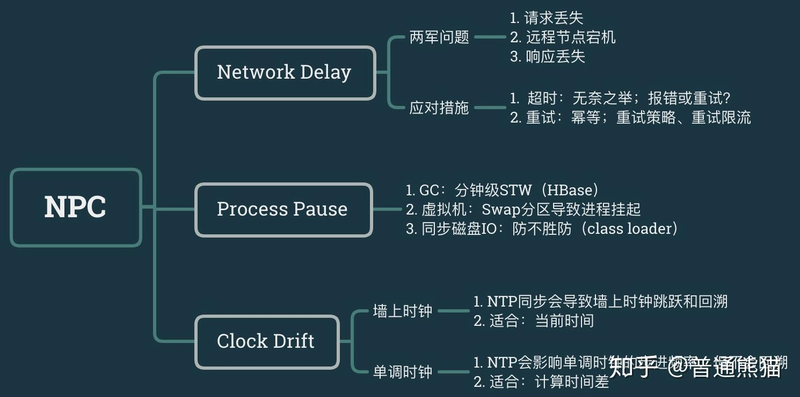

# 分布式锁

## NPC问题

> NPC是指( Network Delay，网络延迟;  Process Pause，进程暂停（GC）【如JAVA 发生GC】;Clock Drift，时钟漂移)，是分布式系统会遇到的三座大山.

1. Network Delay，网络延迟。虽然网络在多数情况下工作的还可以，虽然TCP保证传输顺序和不会丢失，但它无法消除网络延迟问题。一个糟糕的例子是：客户正紧张的坐在屏幕前等待下单结果，服务器也已下单成功，但在返回的确认响应在网络上迷失了，也就是走丢了。
2. Process Pause，进程暂停。有很多种原因可以导致进程暂停：比如编程语言中的GC（垃圾回收机制）会暂停所有正在运行的线程；再比如，我们有时会暂停云服务器，从而可以在不重启的情况下将云服务器从一台主机迁移到另一台主机。我们无法确定性预测进程暂停的时长，你以为持续几百毫秒已经很长了，但实际上持续数分钟之久进程暂停并不罕见。
3. Clock Drift，时钟漂移。现实生活中我们通常认为时间是平稳流逝，单调递增的，但在计算机中不是。计算机使用时钟硬件计时，通常是石英钟，计时精度有限，同时受机器温度影响。为了在一定程度上同步网络上多个机器之间的时间，通常使用NTP协议将本地设备的时间与专门的时间服务器对齐，这样做的一个直接结果是设备的本地时间可能会突然向前或向后跳跃。

