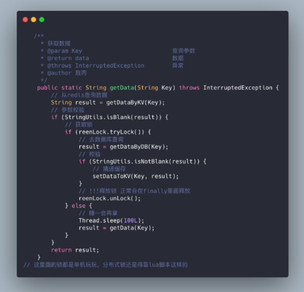

# Redis 雪崩、击穿、穿透

## 缓存雪崩

> 缓存雪崩是指缓存中数据大批量到过期时间，而查询数据量巨大，引起数据库压力过大甚至down机。
 
### 举例
 
 如果所有首页的Key失效时间都是12小时，中午12点刷新的，我零点有个秒杀活动大量用户涌入，假设当时每秒 6000 个请求，本来缓存在可以扛住每秒 5000 个请求，但是缓存当时所有的Key都失效了。此时 1 秒 6000 个请求全部落数据库，数据库必然扛不住，它会报一下警，真实情况可能DBA都没反应过来就直接挂了。此时，如果没用什么特别的方案来处理这个故障，DBA 很着急，重启数据库，但是数据库立马又被新的流量给打死了。这就是我理解的缓存雪崩。
 
 同一时间大面积失效，那一瞬间Redis跟没有一样，那这个数量级别的请求直接打到数据库几乎是灾难性的，你想想如果打挂的是一个用户服务的库，那其他依赖他的库所有的接口几乎都会报错，如果没做熔断等策略基本上就是瞬间挂一片的节奏，你怎么重启用户都会把你打挂，等你能重启的时候，用户早就睡觉去了，并且对你的产品失去了信心，什么垃圾产品。
 
### 解决方案
 
 1. 缓存数据的过期时间设置随机，防止同一时间大量数据过期现象发生。
 2. 如果缓存数据库是分布式部署，将热点数据均匀分布在不同搞得缓存数据库中。
 3. 设置热点数据永远不过期。
 
## 缓存穿透
 
> 缓存穿透是指缓存和数据库中都没有的数据，而用户不断发起请求，我们数据库的 id 都是1开始自增上去的，如发起为id值为 -1 的数据或 id 为特别大不存在的数据。这时的用户很可能是攻击者，攻击会导致数据库压力过大，严重会击垮数据库。

### 解决方案

1. 接口层增加校验，如用户鉴权校验，id做基础校验，id<=0的直接拦截；
2. 从缓存取不到的数据，在数据库中也没有取到，这时也可以将key-value对写为key-null，缓存有效时间可以设置短点，如30秒（设置太长会导致正常情况也没法使用）。这样可以防止攻击用户反复用同一个id暴力攻击
3. 高级用法：布隆过滤器（Bloom Filter），利用高效的数据结构和算法快速判断出你这个Key是否在数据库中存在，不存在你return就好了，存在你就去查了DB刷新KV再return。

## 缓存击穿
> 击穿和雪崩有点像，缓存雪崩是因为大面积的缓存失效，打崩了DB，而缓存击穿不同的是缓存击穿是指一个Key非常热点，在不停的扛着大并发，大并发集中对这一个点进行访问，当这个Key在失效的瞬间，持续的大并发就穿破缓存，直接请求数据库，就像在一个完好无损的桶上凿开了一个洞。

###解决方案

1. 设置热点数据永远不过期
2. 互斥锁

## 总结

- 事前：**Redis** 高可用，主从+哨兵，**Redis cluster**，避免全盘崩溃。
- 事中：本地 **ehcache** 缓存 + **Hystrix** 限流+降级，避免**MySQL** 被打死。
- 事后：Redis 持久化 RDB+AOF，一旦重启，自动从磁盘上加载数据，快速恢复缓存数据。

> 敖丙 | 文 【原创】