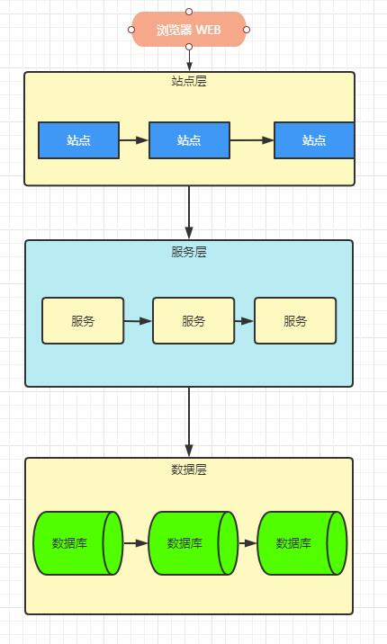

# 秒杀系统优化思路
> 转载：[架构之师](https://www.w3cschool.cn/architectroad/architectroad-optimization-of-seckilling-system.html)

## 一、秒杀业务为什么难做
1）im系统，例如qq或者微博，每个人都读自己的数据（好友列表、群列表、个人信息）；
2）微博系统，每个人读你关注的人的数据，一个人读多个人的数据；
3）秒杀系统，库存只有一份，所有人会在集中的时间读和写这些数据，多个人读一个数据。

例如：小米手机每周二的秒杀，可能手机只有1万部，但瞬时进入的流量可能是几百几千万。
又例如：12306抢票，票是有限的，库存一份，瞬时流量非常多，都读相同的库存。读写冲突，锁非常严重，这是秒杀业务难的地方。那我们怎么优化秒杀业务的架构呢？

## 二、优化方向
优化方向有两个（今天就讲这两个点）：
（1）将请求尽量拦截在系统上游（不要让锁冲突落到数据库上去）。传统秒杀系统之所以挂，请求都压倒了后端数据层，数据读写锁冲突严重，并发高响应慢，几乎所有请求都超时，流量虽大，下单成功的有效流量甚小。以12306为例，一趟火车其实只有2000张票，200w个人来买，基本没有人能买成功，请求有效率为0。

（2）充分利用缓存，秒杀买票，这是一个典型的读多写少的应用场景，大部分请求是车次查询，票查询，下单和支付才是写请求。一趟火车其实只有2000张票，200w个人来买，最多2000个人下单成功，其他人都是查询库存，写比例只有0.1%，读比例占99.9%，非常适合使用缓存来优化。好，后续讲讲怎么个“将请求尽量拦截在系统上游”法，以及怎么个“缓存”法，讲讲细节。

## 三、常见秒杀架构
常见的站点架构基本是这样的（绝对不画忽悠类的架构图）

秒杀架构

* 浏览器端，最上层，会执行到一些JS代码
* 站点层，这一层会访问后端数据，拼html页面返回给浏览器
* 服务层，向上游屏蔽底层数据细节，提供数据访问
* 数据层，最终的库存是存在这里的，mysql是一个典型（当然还有会缓存）

这个图虽然简单，但能形象的说明大流量高并发的秒杀业务架构，大家要记得这一张图。后面细细解析各个层级怎么优化。

## 四、各层次优化细节

### 第一层，客户端怎么优化（浏览器层，APP层）

问大家一个问题，大家都玩过微信的摇一摇抢红包对吧，每次摇一摇，就会往后端发送请求么？回顾我们下单抢票的场景，点击了“查询”按钮之后，系统那个卡呀，进度条涨的慢呀，作为用户，我会不自觉的再去点击“查询”，对么？继续点，继续点，点点点。。。有用么？平白无故的增加了系统负载，一个用户点5次，80%的请求是这么多出来的，怎么整？

1. 产品层面，用户点击“查询”或者“购票”后，按钮置灰，禁止用户重复提交请求；
2. JS层面，限制用户在x秒之内只能提交一次请求；

APP层面，可以做类似的事情，虽然你疯狂的在摇微信，其实x秒才向后端发起一次请求。这就是所谓的“将请求尽量拦截在系统上游”，越上游越好，浏览器层，APP层就给拦住，这样就能挡住80%+的请求，这种办法只能拦住普通用户（但99%的用户是普通用户）对于群内的高端程序员是拦不住的。firebug一抓包，http长啥样都知道，js是万万拦不住程序员写for循环，调用http接口的，这部分请求怎么处理？

### 第二层，站点层面的请求拦截
怎么拦截？怎么防止程序员写for循环调用，有去重依据么？ip？cookie-id？…想复杂了，这类业务都需要登录，用uid即可。在站点层面，对uid进行请求计数和去重，甚至不需要统一存储计数，直接站点层内存存储（这样计数会不准，但最简单）。一个uid，5秒只准透过1个请求，这样又能拦住99%的for循环请求。

5s只透过一个请求，其余的请求怎么办？缓存，页面缓存，同一个uid，限制访问频度，做页面缓存，x秒内到达站点层的请求，均返回同一页面。同一个item的查询，例如车次，做页面缓存，x秒内到达站点层的请求，均返回同一页面。如此限流，既能保证用户有良好的用户体验（没有返回404）又能保证系统的健壮性（利用页面缓存，把请求拦截在站点层了）。

页面缓存不一定要保证所有站点返回一致的页面，直接放在每个站点的内存也是可以的。优点是简单，坏处是http请求落到不同的站点，返回的车票数据可能不一样，这是站点层的请求拦截与缓存优化。

好，这个方式拦住了写for循环发http请求的程序员，有些高端程序员（黑客）控制了10w个肉鸡，手里有10w个uid，同时发请求（先不考虑实名制的问题，小米抢手机不需要实名制），这下怎么办，站点层按照uid限流拦不住了。

### 第三层 服务层来拦截（反正就是不要让请求落到数据库上去）

服务层怎么拦截？大哥，我是服务层，我清楚的知道小米只有1万部手机，我清楚的知道一列火车只有2000张车票，我透10w个请求去数据库有什么意义呢？没错，请求队列！

对于写请求，做请求队列，每次只透有限的写请求去数据层（下订单，支付这样的写业务）

1w部手机，只透1w个下单请求去db

3k张火车票，只透3k个下单请求去db

如果均成功再放下一批，如果库存不够则队列里的写请求全部返回“已售完”。

对于读请求，怎么优化？cache抗，不管是memcached还是redis，单机抗个每秒10w应该都是没什么问题的。如此限流，只有非常少的写请求，和非常少的读缓存mis的请求会透到数据层去，又有99.9%的请求被拦住了。

当然，还有业务规则上的一些优化。回想12306所做的，分时分段售票，原来统一10点卖票，现在8点，8点半，9点，...每隔半个小时放出一批：将流量摊匀。

其次，数据粒度的优化：你去购票，对于余票查询这个业务，票剩了58张，还是26张，你真的关注么，其实我们只关心有票和无票？流量大的时候，做一个粗粒度的“有票”“无票”缓存即可。

第三，一些业务逻辑的异步：例如下单业务与 支付业务的分离。这些优化都是结合 业务 来的，我之前分享过一个观点“一切脱离业务的架构设计都是耍流氓”架构的优化也要针对业务。

### 第四层 最后是数据库层

浏览器拦截了80%，站点层拦截了99.9%并做了页面缓存，服务层又做了写请求队列与数据缓存，每次透到数据库层的请求都是可控的。db基本就没什么压力了，闲庭信步，单机也能扛得住，还是那句话，库存是有限的，小米的产能有限，透这么多请求来数据库没有意义。

全部透到数据库，100w个下单，0个成功，请求有效率0%。透3k个到数据，全部成功，请求有效率100%。

## 五、总结
上文应该描述的非常清楚了，没什么总结了，对于秒杀系统，再次重复下我个人经验的两个架构优化思路：

1. 尽量将请求拦截在系统上游（越上游越好）；
2. 读多写少的常用多使用缓存（缓存抗读压力）；

浏览器和APP：做限速

站点层：按照uid做限速，做页面缓存

服务层：按照业务做写请求队列控制流量，做数据缓存

数据层：闲庭信步

并且：结合业务做优化

## 六、Q&A
问题1、按你的架构，其实压力最大的反而是站点层，假设真实有效的请求数有1000万，不太可能限制请求连接数吧，那么这部分的压力怎么处理？

答：每秒钟的并发可能没有1kw，假设有1kw，解决方案2个：

1. 站点层是可以通过加机器扩容的，最不济1k台机器来呗。
2. 如果机器不够，抛弃请求，抛弃50%（50%直接返回稍后再试），原则是要保护系统，不能让所有用户都失败。

问题2、“控制了10w个肉鸡，手里有10w个uid，同时发请求” 这个问题怎么解决哈？

答：上面说了，服务层写请求队列控制

问题3：限制访问频次的缓存，是否也可以用于搜索？例如A用户搜索了“手机”，B用户搜索“手机”，优先使用A搜索后生成的缓存页面？

答：这个是可以的，这个方法也经常用在“动态”运营活动页，例如短时间推送4kw用户app-push运营活动，做页面缓存。

问题4：如果队列处理失败，如何处理？肉鸡把队列被撑爆了怎么办？

答：处理失败返回下单失败，让用户再试。队列成本很低，爆了很难吧。最坏的情况下，缓存了若干请求之后，后续请求都直接返回“无票”（队列里已经有100w请求了，都等着，再接受请求也没有意义了）

问题5：站点层过滤的话，是把uid请求数单独保存到各个站点的内存中么？如果是这样的话，怎么处理多台服务器集群经过负载均衡器将相同用户的响应分布到不同服务器的情况呢？还是说将站点层的过滤放到负载均衡前？

答：可以放在内存，这样的话看似一台服务器限制了5s一个请求，全局来说（假设有10台机器），其实是限制了5s 10个请求，解决办法：

1. 加大限制（这是建议的方案，最简单）
2. 在nginx层做7层均衡，让一个uid的请求尽量落到同一个机器上

问题6：服务层过滤的话，队列是服务层统一的一个队列？还是每个提供服务的服务器各一个队列？如果是统一的一个队列的话，需不需要在各个服务器提交的请求入队列前进行锁控制？

答：可以不用统一一个队列，这样的话每个服务透过更少量的请求（总票数/服务个数），这样简单。统一一个队列又复杂了。

问题7：秒杀之后的支付完成，以及未支付取消占位，如何对剩余库存做及时的控制更新？

答：数据库里一个状态，未支付。如果超过时间，例如45分钟，库存会重新会恢复（大家熟知的“回仓”），给我们抢票的启示是，开动秒杀后，45分钟之后再试试看，说不定又有票哟~

问题8：不同的用户浏览同一个商品 落在不同的缓存实例显示的库存完全不一样 请问老师怎么做缓存数据一致或者是允许脏读？

答：目前的架构设计，请求落到不同的站点上，数据可能不一致（页面缓存不一样），这个业务场景能接受。但数据库层面真实数据是没问题的。

问题9：就算处于业务把优化考虑“3k张火车票，只透3k个下单请求去db”那这3K个订单就不会发生拥堵了吗？

答：
1. 数据库抗3k个写请求还是ok的；
2. 可以数据拆分；
3. 如果3k扛不住，服务层可以控制透过去的并发数量，根据压测情况来吧，3k只是举例；

问题10；如果在站点层或者服务层处理后台失败的话，需不需要考虑对这批处理失败的请求做重放？还是就直接丢弃？

答：别重放了，返回用户查询失败或者下单失败吧，架构设计原则之一是“fail fast”。

问题11.对于大型系统的秒杀，比如12306，同时进行的秒杀活动很多，如何分流？

答：垂直拆分

问题12、额外又想到一个问题。这套流程做成同步还是异步的？如果是同步的话，应该还存在会有响应反馈慢的情况。但如果是异步的话，如何控制能够将响应结果返回正确的请求方？

答：用户层面肯定是同步的（用户的http请求是夯住的），服务层面可以同步可以异步。

问题13、秒杀群提问：减库存是在那个阶段减呢？如果是下单锁库存的话，大量恶意用户下单锁库存而不支付如何处理呢？

答：数据库层面写请求量很低，还好，下单不支付，等时间过完再“回仓”，之前提过了。

