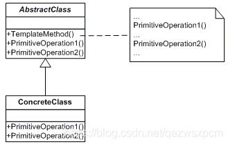

# 模板模式

## 简介

> 模板模式（Template Pattern）中，一个抽象类公开定义了执行它的方法的方式/模板。它的子类可以按需要重写方法实现，但调用将以抽象类中定义的方式进行。 这种类型的设计模式属于行为型模式。定义一个操作中的算法的骨架，而将一些步骤延迟到子类中。

模板模式，其主要的的思想就是做一个模板，提供给客户端进行调用。除去生活中我们经常用到的简历模板、合同模板等等，Java中也有很经典的模板使用，那就是Servlet，HttpService类提供了一个service()方法，这个方法调用七个do方法中的一个或几个，完成对客户端调用的响应。这些do方法需要由HttpServlet的具体则由子类提供。

**模板模式**主要由抽象模板(Abstract Template)角色和具体模板(Concrete Template)角色组成。

- 抽象模板(Abstract Template): 定义了一个或多个抽象操作，以便让子类实现。这些抽象操作叫做基本操作，它们是一个顶级逻辑的组成步骤;定义并实现了一个模板方法。这个模板方法一般是一个具体方法，它给出了一个顶级逻辑的骨架，而逻辑的组成步骤在相应的抽象操作中，推迟到子类实现。顶级逻辑也有可能调用一些具体方法。

- 具体模板(Concrete Template): 实现父类所定义的一个或多个抽象方法，它们是一个顶级逻辑的组成步骤;每一个抽象模板角色都可以有任意多个具体模板角色与之对应，而每一个具体模板角色都可以给出这些抽象方法（也就是顶级逻辑的组成步骤）的不同实现，从而使得顶级逻辑的实现各不相同。

示例图如下:



### 举例

我们以前在玩魂斗罗、双截龙、热血物语、忍者神龟等等游戏的时候，都需要在小霸王游戏机上插卡，然后启动游戏才能玩，其中魂斗罗这种游戏，启动游戏之后就可以直接玩了，但是忍者神龟这种游戏则在启动游戏之后，需要选择其中一个角色才能开始玩。那么我们可以根据这个场景写出一个通用的模板，主要包含启动游戏，玩游戏，结束游戏这几个必须实现的方法，选择人物这个方法改成可选。

那么这个抽象类的代码如下:
```java
abstract class  Game{
	//启动游戏
	protected abstract void  runGame();
	//选择人物
	protected  void choosePerson() {};
	//开始玩游戏
	protected abstract void startPlayGame();
	//结束游戏
	protected abstract void endPlayGame();
	
	//模板方法
	public final void play() {
		runGame();
		choosePerson();
		startPlayGame();
		endPlayGame();
	}
}
```
定义好该抽象类之后，我们再来定义具体模板实现类。这里定义两个游戏类，一个是魂斗罗，一个忍者神龟。

那么代码如下:
```java
class ContraGame extends Game{

   @Override
   protected void runGame() {
   	System.out.println("启动魂斗罗II...");
   }

   @Override
   protected void startPlayGame() {
   	System.out.println("1P正在使用S弹打aircraft...");
   }

   @Override
   protected void endPlayGame() {
   	System.out.println("1P被流弹打死了，游戏结束！");
   }
}

class TMNTGame extends Game{

   @Override
   protected void runGame() {
   	System.out.println("启动忍者神龟III...");
   }

   @Override
   protected void choosePerson() {
   	System.out.println("1P选择了Raph ！");
   }

   @Override
   protected void startPlayGame() {
   	System.out.println("Raph正在使用绝技 “火箭头槌” ");
   }

   @Override
   protected void endPlayGame() {
   	System.out.println("Raph 掉进井盖里死了，游戏结束了！ ");
   }
}

```
最后再来进行测试，测试代码如下:

```
public static void main(String[] args) {
   	Game game = new ContraGame();
   	game.play();
   	System.out.println();
   	game = new TMNTGame();
   	game.play();

}
```
输出结果:
```
启动魂斗罗II...
1P正在使用S弹打aircraft...
1P被流弹打死了，游戏结束！

启动忍者神龟III...
1P选择了Raph ！
Raph正在使用绝技 “火箭头槌” 
Raph 掉进井盖里死了，游戏结束了！ 
```
模板模式优点：

> 扩展性好，对不变的代码进行封装，对可变的进行扩展；
> 可维护性好，因为将公共代码进行了提取，使用的时候直接调用即可；

模板模式缺点：

> 因为每一个不同的实现都需要一个子类来实现，导致类的个数增加，会使系统变得复杂；

使用场景：

> 有多个子类共有逻辑相同的方法；
> 重要的、复杂的方法，可以考虑作为模板方法。

注意事项：

为防止恶意操作，一般模板方法都加上 final 关键词！
